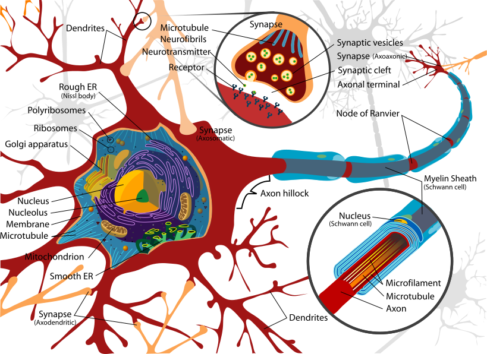
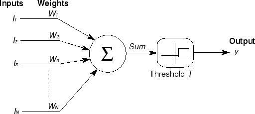
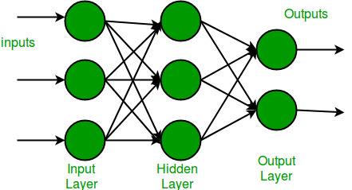

# Redes Neurais Artificiais: Guia Completo

## Sumário
1. [Introdução](#introdução)
2. [Fundamentos Biológicos](#fundamentos-biológicos)
3. [Neurônio Artificial](#neurônio-artificial)
4. [Perceptron](#perceptron)
5. [Multilayer Perceptron (MLP)](#multilayer-perceptron-mlp)
6. [Algoritmos de Treinamento](#algoritmos-de-treinamento)
7. [Funções de Ativação](#funções-de-ativação)
8. [Regularização e Otimização](#regularização-e-otimização)
9. [Aplicações Práticas](#aplicações-práticas)
10. [Exercícios e Projetos](#exercícios-e-projetos)

## Introdução

As **Redes Neurais Artificiais (RNA)** são modelos computacionais inspirados no funcionamento do sistema nervoso biológico. Elas representam uma das abordagens mais poderosas e versáteis do aprendizado de máquina, capazes de:

- **Aprender padrões complexos** em dados
- **Aproximar funções não-lineares** arbitrárias
- **Resolver problemas** de classificação, regressão e clustering
- **Processar diferentes tipos** de dados (imagens, texto, séries temporais)

### Por que estudar Redes Neurais?

1. **Versatilidade**: Aplicam-se a diversos domínios
2. **Poder expressivo**: Podem modelar relações complexas
3. **Evolução contínua**: Base para Deep Learning e IA moderna
4. **Resultados práticos**: Solucionam problemas reais

## Fundamentos Biológicos

### O Neurônio Biológico

O neurônio é a unidade fundamental do sistema nervoso, composto por:




```
Dendritos → Soma → Axônio → Sinapses
    ↑        ↑       ↑        ↑
  Entrada  Processamento  Transmissão  Saída
```

#### Componentes principais:

- **Dendritos**: Recebem sinais de outros neurônios
- **Soma (corpo celular)**: Integra e processa os sinais
- **Axônio**: Transmite o sinal processado
- **Sinapses**: Conexões com outros neurônios

### Processo de Comunicação Neural

1. **Recepção**: Dendritos captam neurotransmissores
2. **Integração**: Soma pondera e combina os sinais
3. **Limiar**: Se o potencial excede um limiar, o neurônio "dispara"
4. **Transmissão**: Sinal elétrico percorre o axônio
5. **Liberação**: Neurotransmissores são liberados nas sinapses

## Neurônio Artificial

### Modelo Matemático

O neurônio artificial é uma abstração matemática do neurônio biológico:



```
x₁ ──w₁──┐
x₂ ──w₂──┤
    ...  ├─→ Σ ──→ f(net) ──→ y
xₙ ──wₙ──┘
    b ───┘
```

#### Equações fundamentais:

**Net Input (Entrada líquida):**
```
net = Σ(wᵢ × xᵢ) + b = w₁x₁ + w₂x₂ + ... + wₙxₙ + b
```

**Saída:**
```
y = f(net)
```

Onde:
- `xᵢ`: Entradas do neurônio
- `wᵢ`: Pesos sinápticos
- `b`: Bias (limiar)
- `f`: Função de ativação
- `y`: Saída do neurônio

### Funções de Ativação Clássicas

#### 1. Função Degrau (Step Function)
```
f(x) = { 1, se x ≥ 0
       { 0, se x < 0
```
- **Uso**: Perceptron clássico
- **Característica**: Saída binária

#### 2. Função Sigmóide
```
f(x) = 1 / (1 + e^(-x))
```
- **Intervalo**: (0, 1)
- **Característica**: Diferenciável, suave
- **Problema**: Saturação dos gradientes

#### 3. Função Tangente Hiperbólica (tanh)
```
f(x) = (e^x - e^(-x)) / (e^x + e^(-x))
```
- **Intervalo**: (-1, 1)
- **Vantagem**: Centrada em zero

#### 4. Função ReLU (Rectified Linear Unit)
```
f(x) = max(0, x)
```
- **Vantagem**: Resolve o problema de gradientes
- **Uso**: Redes profundas modernas

## Perceptron

### Conceito e História

O **Perceptron**, desenvolvido por Frank Rosenblatt em 1957, foi o primeiro algoritmo de aprendizado para redes neurais que garantia convergência para problemas linearmente separáveis.

### Arquitetura do Perceptron

```
Entrada → Pesos → Soma → Ativação → Saída
x₁,x₂,...,xₙ → w₁,w₂,...,wₙ → Σ → f → y
```

### Algoritmo de Treinamento

**Pseudocódigo:**
```
1. Inicializar pesos aleatoriamente
2. Para cada época:
   a. Para cada amostra (x, d):
      - Calcular saída: y = f(Σwᵢxᵢ + b)
      - Calcular erro: e = d - y
      - Atualizar pesos: wᵢ = wᵢ + η × e × xᵢ
      - Atualizar bias: b = b + η × e
3. Repetir até convergência
```

**Parâmetros:**
- `η` (eta): Taxa de aprendizado
- `d`: Saída desejada
- `e`: Erro

### Teorema da Convergência

**Teorema**: Se os dados são linearmente separáveis, o algoritmo Perceptron converge em um número finito de iterações.

### Limitações do Perceptron

1. **Separabilidade linear**: Só resolve problemas linearmente separáveis
2. **Problema XOR**: Não consegue resolver o XOR
3. **Função de ativação**: Limitado a funções lineares por partes

## Multilayer Perceptron (MLP)

### Superando as Limitações

O **MLP** resolve as limitações do Perceptron através de:

1. **Camadas ocultas**: Permitem não-linearidade
2. **Múltiplas camadas**: Aumentam poder expressivo
3. **Backpropagation**: Algoritmo de treinamento eficiente

### Arquitetura MLP



```
Camada de    Camada(s)      Camada de
Entrada   →   Oculta(s)   →   Saída

x₁ ──────┐   h₁ ────────┐   y₁
x₂ ──────┤   h₂ ────────┤   y₂
  ...    ├─→  ... ────────┤→  ...
xₙ ──────┘   hₘ ────────┘   yₖ
```

### Teorema da Aproximação Universal

**Teorema**: Uma rede neural com uma única camada oculta e um número suficiente de neurônios pode aproximar qualquer função contínua com precisão arbitrária.

### Regras Práticas para Arquitetura

Historicamente, quando redes neurais eram menores e o custo computacional mais alto, surgiram algumas **heurísticas** para estimar o tamanho inicial da camada oculta em redes totalmente conectadas (MLPs).  
Essas regras **não são leis fixas**, mas podem servir como **ponto de partida**:

#### Número de neurônios na camada oculta:

- 1. Regra dos 2/3:
$$
\text{neurônios ocultos} \approx \frac{2}{3} \times (\text{neurônios de entrada}) + \text{neurônios de saída}
$$

> **Ideia:** reduzir a dimensionalidade da entrada mantendo espaço para representar as saídas.

- 2. Média geométrica

$$
\text{neurônios ocultos} \approx \sqrt{\text{entradas} \times \text{saídas}}
$$

> **Ideia:** buscar um equilíbrio proporcional entre o tamanho da entrada e o tamanho da saída.

---

- 3. Experimentação incremental *(abordagem mais usada atualmente)*

    - Comece com uma rede pequena.  
    - Monitore as métricas de treinamento e validação.  
    - Aumente gradualmente a quantidade de neurônios até atingir bom desempenho sem sobreajuste (*overfitting*).  
    - Utilize técnicas de regularização (*dropout*, L2, *batch normalization*) para manter a generalização.


!!! tip

    > Essas regras não consideram fatores como complexidade do problema, qualidade dos dados ou arquiteturas modernas (CNNs, RNNs, Transformers). 

    > Hoje, a prática recomendada é combinar um **chute inicial** com **ajuste via validação cruzada** e ferramentas de **busca de hiperparâmetros**.


#### Número de camadas ocultas:

O número de camadas ocultas em uma rede neural influencia diretamente a **capacidade de representação** do modelo.  
De forma geral, temos:

- **1 camada oculta:**  
  Indicada para problemas que se tornam linearmente separáveis após uma transformação não linear.  
  Exemplo: classificação simples com fronteiras suaves.

- **2 camadas ocultas:**  
  Capaz de aproximar **qualquer função contínua** arbitrária (Teorema da Aproximação Universal).  
  Útil quando há relações mais complexas entre entrada e saída.

- **3 ou mais camadas ocultas:**  
  Necessárias para representar **funções descontínuas** ou padrões muito complexos.  
  Base do **Deep Learning**, permitindo a extração de características em múltiplos níveis.

> 💡 **Observação:** Embora mais camadas aumentem a capacidade do modelo, também elevam o risco de **overfitting** e a necessidade de mais dados e regularização.


## Algoritmos de Treinamento

### Backpropagation

O **algoritmo de retropropagação** é o método padrão para treinar MLPs.

#### Fases do Algoritmo:

**1. Forward Pass (Propagação Direta):**
```python
# Para cada camada l
for l in range(1, L):
    z[l] = W[l] @ a[l-1] + b[l]  # Linear combination
    a[l] = activation(z[l])       # Activation function
```

**2. Backward Pass (Retropropagação):**
```python
# Calcular erro da saída
delta[L] = (a[L] - y) * activation_derivative(z[L])

# Propagar erro para trás
for l in range(L-1, 0, -1):
    delta[l] = (W[l+1].T @ delta[l+1]) * activation_derivative(z[l])
```

**3. Atualização dos Pesos:**
```python
# Para cada camada
for l in range(1, L):
    W[l] -= learning_rate * (delta[l] @ a[l-1].T)
    b[l] -= learning_rate * delta[l]
```

### Variações do Gradient Descent

#### 1. Batch Gradient Descent
- **Característica**: Usa todo o dataset por iteração
- **Vantagem**: Convergência estável
- **Desvantagem**: Lento para grandes datasets

#### 2. Stochastic Gradient Descent (SGD)
- **Característica**: Uma amostra por vez
- **Vantagem**: Rápido, pode escapar de mínimos locais
- **Desvantagem**: Convergência ruidosa

#### 3. Mini-batch Gradient Descent
- **Característica**: Pequenos grupos de amostras
- **Vantagem**: Balanceia velocidade e estabilidade
- **Uso**: Mais comum na prática

## Funções de Ativação Modernas

### ReLU e Variações

#### ReLU (Rectified Linear Unit)
```python
def relu(x):
    return np.maximum(0, x)
```
**Vantagens:**
- Computacionalmente eficiente
- Resolve gradientes que desvanecem
- Induz esparsidade

**Desvantagens:**
- Neurônios podem "morrer"
- Não diferenciável em zero

#### Leaky ReLU
```python
def leaky_relu(x, alpha=0.01):
    return np.where(x > 0, x, alpha * x)
```
**Vantagem:** Evita neurônios mortos

#### ELU (Exponential Linear Unit)
```python
def elu(x, alpha=1.0):
    return np.where(x > 0, x, alpha * (np.exp(x) - 1))
```
**Vantagem:** Suave em toda parte

### Funções de Ativação para Saída

#### Softmax (Classificação Multiclasse)
```python
def softmax(x):
    exp_x = np.exp(x - np.max(x))
    return exp_x / np.sum(exp_x)
```

#### Linear (Regressão)
```python
def linear(x):
    return x
```

## Regularização e Otimização

### Técnicas de Regularização

#### 1. L1 Regularization (Lasso)
```
Loss = MSE + λ₁ × Σ|wᵢ|
```
- **Efeito**: Induz esparsidade

#### 2. L2 Regularization (Ridge)
```
Loss = MSE + λ₂ × Σwᵢ²
```
- **Efeito**: Reduz magnitude dos pesos

#### 3. Dropout
- **Mecanismo**: Desativa neurônios aleatoriamente durante treinamento
- **Vantagem**: Reduz overfitting

#### 4. Early Stopping
- **Mecanismo**: Para treinamento quando validação para de melhorar
- **Implementação**: Monitora loss de validação

### Otimizadores Avançados

#### Adam (Adaptive Moment Estimation)
```python
# Parâmetros adaptativos
m = β₁ × m + (1 - β₁) × gradient
v = β₂ × v + (1 - β₂) × gradient²

# Correção de viés
m_hat = m / (1 - β₁ᵗ)
v_hat = v / (1 - β₂ᵗ)

# Atualização
weights -= learning_rate × m_hat / (√v_hat + ε)
```
