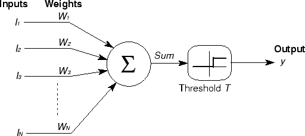

# Deep Learning e Visão Computacional usando TensorFlow

Este tutorial é um guia rápido de consulta para o mundo do deep learning. 

Aqui você encontra por meio de exemplos um pouco de teoria para compreesão e aplicação dos conceitos.

## Objetivos

1. [Introdução](#introdução)
2. [Configuração e Instalação](#configuração-e-instalação)
3. [Entendendo os Conceitos Básicos](#entendendo-os-conceitos-básicos)
   - [Perceptron](#perceptron)
   - [Perceptron de Múltiplas Camadas (MLP)](#perceptron-de-múltiplas-camadas-mlp)
   - [Retropropagação](#retropropagação)
   - [Otimizadores](#otimizadores)
4. [Redes Neurais Convolucionais (CNN)](#redes-neurais-convolucionais-cnn)
5. [Implementando uma MLP Simples](#implementando-uma-cnn-simples)
6. [Treinando o Modelo](#treinando-o-modelo)
7. [Avaliação e Conclusão](#avaliação-e-conclusão)

# Introdução

Deep learning é um subconjunto de aprendizado de máquina onde redes neurais artificiais, algoritmos inspirados no cérebro humano, aprendem a partir de grandes quantidades de dados. Da mesma forma, visão computacional é um campo da inteligência artificial que treina computadores para interpretar e compreender o mundo visual.

## Configuração e Instalação

Primeiro, certifique-se de que Python e TensorFlow estão instalados em seu sistema. Você pode instalar o TensorFlow com o seguinte comando:

```bash
pip install tensorflow
```

## Entendendo os Conceitos Básicos

### Perceptron

O **Perceptron** é um modelo de rede neural simples, geralmente utilizado para classificação binária. Consiste em uma única camada de neurônios, e sua operação pode ser descrita pela fórmula:




Podemos calcular o valor de um neuronio da seguinte forma:


output = activation_function(weighted_sum + bias)

 O perceptron é uma das formas mais simples de uma rede neural, utilizado para classificação binária. A saída de um neurônio no perceptron pode ser calculada usando a seguinte fórmula:

```python
output = activation_function(weighted_sum + bias)
```

Onde: 
  
  - `weighted_sum`: é a soma ponderada das entradas (inputs) multiplicadas pelos respectivos pesos (weights).
  - `activation_function`: refere-se à função que define o limiar de ativação do neurônio, como sigmoid, relu ou softmax.
  - `bias`: é um termo adicional que permite ajustar a saída ao longo da função de ativação para melhor adaptação dos dados


### Perceptron de Múltiplas Camadas (MLP)


O `MLP (Multilayer Perceptron)` é uma extensão do modelo perceptron que inclui múltiplas camadas. A estrutura típica de um MLP consiste em:

  - `Uma camada de entrada`, que recebe os dados.
  - `Uma ou mais camadas ocultas`, que transformam os dados de entrada através de pesos, biases e funções de ativação.
  - `Uma camada de saída`, que produz a previsão final do modelo.

Cada camada é `totalmente conectada` à próxima, o que significa que cada neurônio em uma camada está conectado a todos os neurônios na camada seguinte. O MLP é capaz de aprender representações não-lineares dos dados, o que o torna adequado para problemas complexos de classificação e regressão.


### Funções de Ativação

As **funções de ativação** são componentes essenciais nas redes neurais, responsáveis por introduzir não-linearidades no modelo. Sem elas, a rede seria essencialmente um modelo linear e incapaz de aprender e representar dados complexos que requerem não-linearidade para sua modelagem. As funções de ativação decidem se um neurônio deve ser ativado ou não, com base no valor da soma ponderada de suas entradas.

#### Exemplos Comuns:
- **`ReLU (Rectified Linear Unit)`**: Oferece uma resposta linear para todos os valores positivos e zero para valores negativos. É a mais usada devido à sua eficiência computacional e à capacidade de mitigar o problema do desaparecimento do gradiente em redes profundas.
- **`Sigmoid`**: Transforma os valores em uma faixa entre 0 e 1, útil especialmente para modelos onde precisamos de uma probabilidade como saída; contudo, é menos usada em camadas ocultas devido a problemas de desaparecimento de gradiente.
- **`Tanh (Tangente Hiperbólica)`**: Semelhante à sigmoid, mas transforma os valores em uma faixa entre -1 e 1, centrando os dados e, portanto, melhorando a eficiência do aprendizado nas camadas ocultas.


### Retropropagação (Backpropagation)

A **Retropropagação** é uma técnica para treinar redes neurais, permitindo o ajuste dos pesos de conexão após cada iteração de treinamento. Este método utiliza o `cálculo do gradiente` da `função de perda` em relação a cada peso, propagando o erro de saída de volta pela rede para atualizar os pesos. Isso minimiza a função de perda ao longo do tempo, melhorando a precisão do modelo ao ajustá-lo mais eficazmente aos dados de treinamento.

#### Funcionamento:

- Calcula-se o gradiente da função de perda para determinar a direção na qual os pesos devem ser ajustados para minimizar o erro.
- Os pesos são atualizados utilizando este gradiente, geralmente com a ajuda de um otimizador como SGD, Adam, entre outros.
- Este processo é repetido para cada lote de dados (batch) durante várias épocas, ajustando progressivamente os pesos para melhorar o desempenho do modelo.

Esses ajustes permitem que a rede aprenda de forma eficiente, refinando seus pesos para reduzir o erro total e aumentar a precisão nas tarefas de classificação ou regressão.

### Otimizadores

**Otimizadores** são algoritmos projetados para otimizar o processo de treinamento de uma rede neural, ajustando os pesos e a taxa de aprendizagem. É importante para determinar a rapidez e eficácia com que uma rede neural aprende. 

Alguns exemplos comuns incluem:

  - SGD (Descida do Gradiente Estocástico)
  - Adam
  - RMSprop
  - Dentre outros, cada um com suas próprias características e adequações a diferentes tipos de problemas e conjuntos de dados.


### Redes Neurais Convolucionais (CNN)

**Redes Neurais Convolucionais (CNNs)** são uma classe especializada de redes neurais profundas que são particularmente para tarefas de processamento de imagem e vídeo. Utilizam o processo de convolução para capturar características visuais importantes como bordas, texturas e padrões mais complexos sem a necessidade de intervenção ou extração manual de características.

### Principais Componentes

- **Camadas Convolucionais**: O coração de uma CNN. Estas camadas utilizam filtros que realizam a convolução sobre a entrada para criar mapas de características que resumem as presenças de características específicas na entrada.
- **Função de Ativação**: Normalmente, uma função ReLU é aplicada após cada convolução para introduzir não-linearidades ao modelo, ajudando-o a aprender mais complexidades.
- **Camadas de Pooling**: Seguem as camadas convolucionais e são usadas para reduzir as dimensões dos mapas de características, o que ajuda a diminuir o cálculo necessário e também controla o overfitting.
- **Camadas Densas (Fully Connected Layers)**: Após várias camadas convolucionais e de pooling, a rede utiliza uma ou mais camadas densas onde a classificação final é realizada baseada nas características extraídas anteriormente.

#### Funcionamento

Uma CNN recebe uma imagem como entrada, que é passada através de uma série de camadas convolucionais com filtros (kernels), camadas de pooling, e eventualmente camadas densas para produzir uma saída, que pode ser uma classificação ou outra interpretação da imagem. Em cada camada convolucional, a rede aprende a identificar características cada vez mais complexas. À medida que os dados avançam pela rede, a "visão" da rede torna-se cada vez mais abstrata, permitindo que ela reconheça grandes padrões compostos por características menores capturadas nas primeiras camadas.

#### Aplicações

As CNNs têm sido usadas com grande sucesso em uma variedade de aplicações de visão computacional:

- **`Reconhecimento de Imagens`**: Identificação de objetos, pessoas, cenas e atividades em imagens.
- **`Classificação de Imagens`**: Classificar imagens em categorias pré-definidas.
- **`Detecção de Objetos`**: Localizar e identificar múltiplos objetos dentro de uma única imagem.
- **`Segmentação Semântica`**: Classificar cada pixel de uma imagem em uma categoria de objeto, permitindo uma compreensão detalhada da cena.


## Implementando um MLP Simples

Vamos implementar um exemplo simples de uma rede neural multicamadas (MLP) usando TensorFlow, aplicada ao conjunto de dados `MNIST`, que consiste em `imagens de dígitos escritos à mão`:


### Importando o dataset e bibliotecas

Começamos importando a biblioteca `tensorflow` e o dataset mninst. Esse dataset é bem famoso e faz parte dos do da biblioteca tensorflow. Precisamos fazer uma transformação simples nas imagens de entrada para normalizar entre 0 e 1.

```python
import tensorflow as tf

# Carregando o conjunto de dados MNIST
mnist = tf.keras.datasets.mnist
(x_train, y_train), (x_test, y_test) = mnist.load_data()

# Normalizando os dados
x_train, x_test = x_train / 255.0, x_test / 255.0
```


### Criando a Rede Neural

Para construir nossa rede neural, utilizaremos a classe Sequential do TensorFlow, que permite compor modelos camada por camada de maneira simples e direta. Aqui está o detalhamento de cada componente utilizado:

!!! warning
    Substitua os campos `<QUANTIDADE_NEURONIOS> `e `<FUNCAO_ATIVACAO>` nos lugares indicados para configurar o número de neurônios e as funções de ativação.

!!! tip
    A quantidade de neurônios na `camada de saída` deve ser igual à quantidade de classes a serem preditas no MNIST, que são 10 (dígitos de 0 a 9).

!!! tip
    Utilize a função de ativação `relu` para as camadas intermediárias, pois ajuda a resolver o problema do desaparecimento do gradiente em redes profundas. Para a camada de saída, use `softmax` para converter as saídas em probabilidades de pertencimento às classes.


#### Componentes do Modelo

- `Sequential`: Esta é a classe base para definir uma pilha de camadas de rede neural. Você começa com uma lista vazia e adiciona camadas usando a notação de lista. Cada camada adicionada é empilhada sobre a anterior, o que facilita a modelagem de um fluxo de dados direto (feedforward).
- `Flatten`: Transforma a matriz 2D de entrada (28x28 pixels da imagem) em um vetor 1D. Isso é necessário porque a primeira camada densa (Dense) espera um vetor como entrada.
- `Dense`: É a camada de neurônios densamente conectados ou completamente conectados. Cada neurônio recebe entrada de todos os neurônios da camada anterior, mantendo uma conexão densa.
  - <QUANTIDADE_NEURONIOS>: Aqui você define quantos neurônios deseja nesta camada.
  - <FUNCAO_ATIVACAO>: Define a função de ativação a ser usada. A função relu é comum para camadas internas.


```python
# Criando o modelo MLP
model = tf.keras.models.Sequential([
  tf.keras.layers.Flatten(input_shape=(28, 28)),
  tf.keras.layers.Dense(<QUANTIDADE_NEURONIOS>, activation=<FUNCAO_ATIVACAO>),
  tf.keras.layers.Dense(<QUANTIDADE_NEURONIOS>, activation=<FUNCAO_ATIVACAO>)
])
```

## Compilando o Modelo

Agora, vamos compilar o modelo utilizando o `otimizador Adam` e a função de perda `sparse_categorical_crossentropy`, adequada para classificação de múltiplas classes onde as classes são fornecidas como números inteiros:


!!! warning
    Substitua os campos `<KEY>` por valores convenientes. Para `<METRICA>` utilize `accuracy`.


```python
model.compile(optimizer=<OTIMIZADOR>, 
              loss=<LOSS>, 
              metrics=[<METRICA>])
```

## Compilando o Modelo

Agora, vamos compilar o modelo passando os conjuntos de dados `x_train` e `y_train`, definindo a quantidade épocas de treinamento e ajustando um subset de 20% para validação. 

!!! warning
    Substitua os campos `<KEY>` por valores convenientes. Defina 30 épocas e 0.2 de valiçao.

```python
# Treinando o modelo
epocas_hist = model.fit(<X_TREINO>, <Y_TREINO>, epochs=<EPOCAS>, validation_split=<VALIDACAO>)
```

## Visualizando o historico de treinamento

O historico de treinamento é salvo na variavel `epocas_hist`, podemos visualizar utlizando o pandas

```python
import pandas as pd

df_historico = pd.DataFrame(epocas_hist.history)
df_historico.info()

df_historico[['loss','val_loss']].plot(); plt.show();
df_historico[['accuracy','val_accuracy']].plot(); plt.show();

```

## Avaliação e Conclusão

Após o treinamento, avaliamos o modelo no conjunto de teste para verificar sua acurácia e a perda:

!!! warning
    Substitua os campos `<KEY>` por valores convenientes. 


```python
test_loss, test_acc = model.evaluate(<X_TESTE>, <Y_TESTE>)
print(f"Teste Acurácia: {test_acc:.3f}, Teste Loss: {test_loss:.3f}")

```

## Salvando o modelo

```python
# Salvando o modelo treinado
model.save('mnist_mlp_model.h5')
```

## Importando uma Imagem e Usando com o Modelo Treinado

Para usar uma imagem própria e verificar como o modelo MLP prevê o dígito, precisamos garantir que a imagem seja processada de maneira semelhante ao conjunto de dados MNIST. A imagem deve ser em escala de cinza, de tamanho 28x28 pixels, e normalizada.

```python
import tensorflow as tf
from tensorflow.keras.preprocessing import image
import numpy as np
import matplotlib.pyplot as plt

# Carregando o modelo treinado (certifique-se de que o modelo está disponível)
model = tf.keras.models.load_model('mnist_mlp_model.h5')

# Função para carregar e preparar a imagem
def load_and_prepare_image(filepath):
    img = image.load_img(filepath, color_mode='grayscale', target_size=(28, 28))
    img = image.img_to_array(img)
    img = img.reshape(1, 28, 28)
    img = img.astype('float32')
    img /= 255.0
    return img

# Caminho para a sua imagem
filepath = 'path_to_your_image.png' # escolha uma imagem com um numero simples 

# Carregando e preparando a imagem
img = load_and_prepare_image(filepath)

# Fazendo a previsão
predictions = model.predict(img)
predicted_digit = np.argmax(predictions)

# Mostrando a imagem e a previsão
plt.imshow(img.reshape(28, 28), cmap='gray')
plt.title(f'Previsão: {predicted_digit}')
plt.show()

```