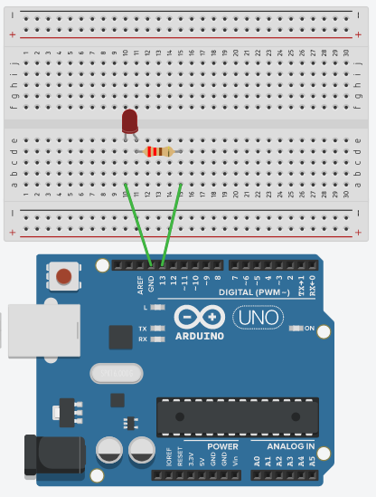

## O que esse código faz?

Este código de exemplo demonstra como piscar um LED com arduino (blink led).


## Circuito protoboard




## Código

```c
int led = 13; //defindo o valor 13 para a variável led

void setup(){
    pinMode(led,OUTPUT); //declara led (pino 13 do arduino) como saida (OUTPUT)
}
    
void loop(){
    digitalWrite(led, HIGH); //acende (HIGH) o led
    delay(1000); //delay em milisegundos (1 seg)
    digitalWrite(led, LOW); //apaga o led (LOW)
    delay(1000); //delay em milisegundos
}
```
??? note "Circuito simulador"
    


## Links para Download

* [Código arduino](hello.ino) 

* [Thinkercad online](https://www.tinkercad.com/things/4e6ZDm63O2D-swanky-robo-blad/editel?sharecode=MftwpiXu-ym4ISoTz_QquJtsnkLvIIlr9fNjBM0J8LI)

* [SimulIDE](hello.simu)
