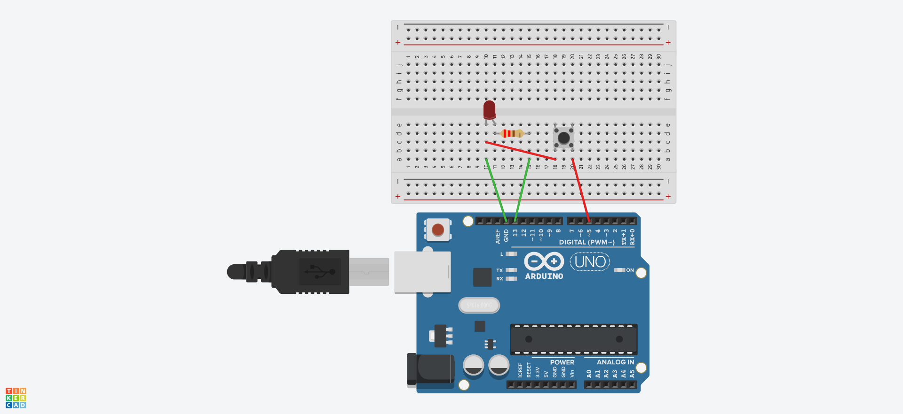

## O que esse código faz?

Este código de exemplo demonstra como acender e apagar um LED em um intervalo de 100 milissegundos ao pressionar um botão com Arduino.

## Circuito protoboard



## Código

```c
const int led = 13; //define o apelido led para o valor 13
const int botao = 5; //define o apelido botao para o valor 5

void setup(){
  pinMode(led, OUTPUT); //declara o pino13 (led) como saída
  pinMode(botao, INPUT_PULLUP); //declara o pino5 (botao) como entrada
}

void loop(){
  // Faz a leitura do botao
  if (digitalRead(botao) == LOW) {
    digitalWrite(led, HIGH); //acende o led
    delay(100); //delay em milissegundos
    digitalWrite(led, LOW); //apaga o led
    delay(100); //delay em milissegundos
  }
}
```

??? note "Circuito simulador"
    

## Links para Download

* [Código arduino](botao_led.ino)

* [Thinkercad online](https://www.tinkercad.com/things/7Kj0XM4gX3q-spectacular-gadzery-saddai/editel?sharecode=OQaQZ0VdZj8Wn1A6vE5bQYnCYxzP5o5q3L7rAaiYlIs)

* [SimulIDE](botao_led.simu)