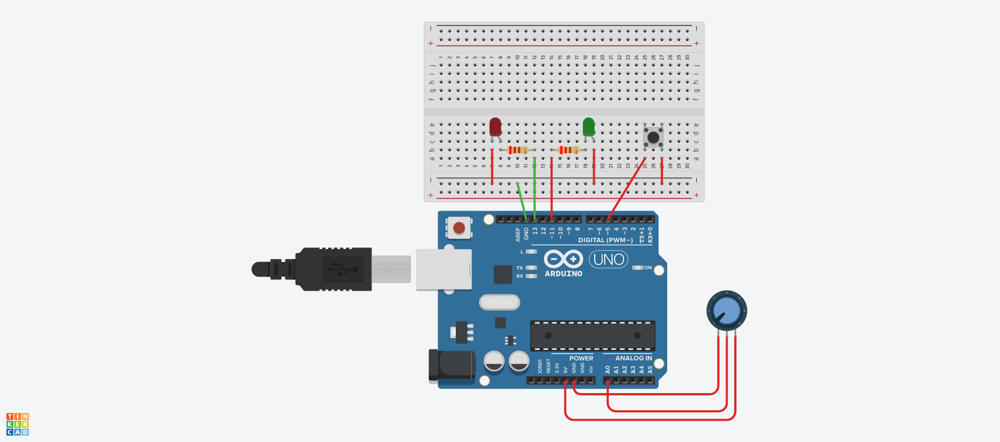

## O que esse código faz?

Este código de exemplo demonstra como controlar dois LEDs com Arduino usando um botão e um potenciômetro. Um LED é acionado por uma interrupção externa quando o botão é pressionado, e o outro LED alterna seu estado quando o valor do potenciômetro é maior ou igual a 500.

## Circuito protoboard



## Código

```c
const int led = 13; //define o apelido led para o valor 13
const int botao = 2; //define o apelido botao para o valor 2
const int ledPwm = 11; //define o apelido ledPwm para o valor 11
const int potAD = A0; //define o apelido potenciometro para o valor A0

void setup(){
  // Entradas e saídas digitais
  pinMode(led, OUTPUT); //declara o pino13 (led) como saída
  pinMode(botao, INPUT_PULLUP); //declara o pino2 (botao) como entrada
  // Entradas e saídas analógicas
  pinMode(ledPwm, OUTPUT); //declara o pino11 (ledPwm) como saída
  pinMode(potAD, INPUT); //declara o pinoA0 (potenciometro) como entrada

  // Configuração da Interrupção
  attachInterrupt(digitalPinToInterrupt(botao), interrupcaoPino2, RISING);  // Configura o pino2 como interrupção externa do tipo Rising (borda de LOW para HIGH)
}

void loop(){  
  // Programa principal
  int pot = analogRead(potAD);
  if (pot >= 500){
    digitalWrite(ledPwm, !digitalRead(ledPwm));	
    delay(100);    
  } 
}

void interrupcaoPino2() // Função de interrupção do pino2, é executado quando o botão do pino2 é pressionado
{                    
  digitalWrite(led, !digitalRead(led));
}
```

??? note "Circuito simulador"
    

## Links para Download

* [Código arduino](botao_pot_interrupt.ino)

* [Thinkercad online](https://www.tinkercad.com/things/9a0lWXyFgK8-marvelous-robo-woomy/editel?sharecode=5f9Jm3Bc3gKQ2YG0KrrRNRH50wzv5X8RGpDd6bq3YXM)

* [SimulIDE](botao_pot_interrupt.simu)