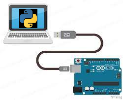

## O que esse código faz?

Este código de exemplo demonstra como realizar a comunicação serial entre um arduino e um computador, neste exeplo vamos usar um script python.



## Um pouquinho de teoria

- ``Definição de comunicação serial``: A comunicação serial é um método de comunicação de dados em que os bits de informações são transmitidos sequencialmente, um após o outro, através de um único canal de comunicação. É uma abordagem simples e comum para transferir dados entre dispositivos, como microcontroladores e computadores.

- ``Taxa de transmissão (baud rate)``: A taxa de transmissão, ou baud rate, é a velocidade na qual os bits são transmitidos através do canal de comunicação serial. É medida em bits por segundo (bps). Taxas de transmissão comuns comumente utilizadas incluem 9600, 19200 e 115200 bps. A taxa de transmissão deve ser configurada corretamente em ambos os dispositivos de comunicação (transmissor e receptor) para garantir que os dados sejam transmitidos e recebidos com precisão.

- ``Protocolos de comunicação serial``: Existem vários protocolos de comunicação serial disponíveis, cada um com suas próprias especificações e características. Alguns dos protocolos mais comuns incluem UART (Universal Asynchronous Receiver/Transmitter), SPI (Serial Peripheral Interface) e I2C (Inter-Integrated Circuit). Neste tutorial, estamos usando a comunicação UART através da porta serial disponível no Arduino.

- ``Aplicações da comunicação serial``: A comunicação serial é amplamente utilizada em várias aplicações, como comunicação entre microcontroladores e periféricos (por exemplo, sensores, displays, etc.), comunicação entre computadores e dispositivos eletrônicos (por exemplo, impressoras, modems, etc.), e até mesmo em redes de comunicação industrial (por exemplo, Modbus, Profibus, etc.).

- ``Vantagens da comunicação serial``: Algumas das principais vantagens da comunicação serial incluem sua simplicidade, baixo custo, capacidade de transmitir dados a longas distâncias e baixa contagem de pinos nos dispositivos envolvidos.


## Códigos

O código funciona como um "Eco", o script Python enviará a mensagem para o Arduino, que a lerá e a enviará de volta. A mensagem será exibida no terminal ou prompt de comando.

```c
void setup() {
  Serial.begin(9600); // Inicia a comunicação serial com uma taxa de transmissão de 9600 bps
}

void loop() {
  if (Serial.available() > 0) { // Verifica se há dados disponíveis para leitura
    String message = Serial.readString(); // Lê a mensagem enviada pelo Python
    Serial.println(message); // Envia a mensagem de volta para o Python
  }
}
```

A segunda parte é o código python (lembre-se de criar um arduino_serial.py)


```python
import serial
import time

def main():
    ser = serial.Serial('COM3', 9600) # Altere 'COM3' para a porta serial do seu Arduino
    time.sleep(2) # Dá tempo para a conexão ser estabelecida

    while True:
        msg = input("Digite uma mensagem para enviar ao Arduino: ")
        ser.write(msg.encode()) # Envia a mensagem para o Arduino
        time.sleep(1) # Aguarda a resposta do Arduino
        
        while ser.inWaiting() > 0:
            response = ser.readline().decode().strip() # Lê a resposta do Arduino
            print("Resposta do Arduino:", response)

if __name__ == "__main__":
    main()

```

## Executando o script

- Abra o terminal ou prompt de comando e navegue até a pasta onde o arquivo "arduino_serial.py" está localizado.
- Execute o seguinte comando: python arduino_serial.py
- Digite a mensagem que deseja enviar para o Arduino e pressione Enter.
- O script Python enviará a mensagem para o Arduino, que a lerá e a enviará de volta. A mensagem será exibida no terminal ou prompt de comando.

## Desafios

### Desafio 1

Faça os ajustes necessários para solucionar o checkpoint.