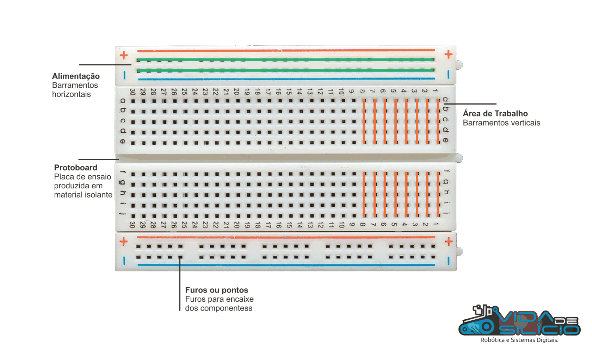

## Dicas úteis para o dia a dia

## Dicas gerais para qualquer desafio:

- `Entenda o problema`: Antes de começar a escrever o código, certifique-se de compreender o problema que você precisa resolver. Leia o enunciado do exercício com atenção e faça anotações, se necessário.
- `Planeje antes de programar`: Pense sobre a lógica do programa e como abordar o problema antes de escrever o código. Isso pode incluir a criação de um fluxograma, escrever um pseudocódigo ou listar os passos para resolver o problema.
- `Divida e conquiste`: Separe problemas maiores ou mais complexos em partes menores e mais gerenciáveis. Isso facilita a resolução do problema e a depuração do código.
- `Comente seu código`: Escreva comentários claros e concisos ao longo do seu código para explicar o que cada parte faz. Isso facilita a revisão e a compreensão do código, tanto para você quanto para os outros.
- `Mantenha o código organizado`: Use indentação e espaçamento consistentes para tornar seu código mais legível e fácil de entender.
- `Nomeie variáveis e funções adequadamente`: Escolha nomes significativos e descritivos para variáveis e funções, para que seja fácil identificar sua finalidade no código.
- `Pratique a reutilização de código`: Sempre que possível, reutilize partes do código que já foram escritas para resolver problemas semelhantes. Isso pode economizar tempo e esforço.
- `Teste e depure`: Teste seu código frequentemente para garantir que ele esteja funcionando corretamente e resolvendo o problema proposto. 
- `Aprenda com seus erros`: Se você encontrar um erro ou dificuldade, tente entender o motivo e aprenda com ele. Isso ajudará a evitar cometer o mesmo erro no futuro.
- `Peça ajuda quando necessário`: Não hesite em buscar ajuda de colegas, ou comunidades online, como fóruns e grupos de discussão, se você estiver enfrentando dificuldades ou tiver dúvidas.

## Hardware:

### Protoboard

A **protoboard** é uma ferramenta essencial para montagem de circuitos eletrônicos de forma rápida, flexível e sem a necessidade de soldagem. Ela permite o desenvolvimento e teste de circuitos antes de sua implementação final. Abaixo, estão as principais características e boas práticas para uso eficiente da protoboard:

- **Estrutura Interna**: A protoboard possui trilhas de conexões horizontais e verticais, que facilitam a distribuição de sinais e alimentação elétrica. As trilhas centrais geralmente são divididas, permitindo a inserção de componentes de forma independente em cada lado.
- **Uso Eficiente de Espaço**: Organize os componentes de maneira lógica, utilizando as trilhas de alimentação para VCC e GND nas extremidades da protoboard, e distribuindo os componentes ativos e passivos nas áreas centrais.
- **Manutenção da Integridade das Conexões**: Certifique-se de que os fios de conexão (jumpers) estejam firmemente encaixados nas trilhas, para evitar mau contato e possíveis falhas no circuito.
- **Utilização de Capacitores de Desacoplamento**: Em projetos mais complexos, é recomendável a adição de capacitores de desacoplamento próximos aos CI's para estabilizar a alimentação e reduzir ruídos.

- Guia detalhado de utilização da protoboard: [https://portal.vidadesilicio.com.br/protoboard/](https://portal.vidadesilicio.com.br/protoboard/)

### Chaves e botoões

As **chaves** e **botões** são dispositivos de entrada essenciais em sistemas embarcados, proporcionando uma interface de controle direta e intuitiva. Eles desempenham um papel crucial em aplicações que exigem a interação do usuário com o hardware.

- Referência para você conhecer mais sobre chaves e botões: [https://www.robocore.net/tutoriais/introducao-a-chaves-e-botoes](https://www.robocore.net/tutoriais/introducao-a-chaves-e-botoes)

### Leds 

Os **LEDs (Light Emitting Diodes)** são componentes amplamente utilizados como indicadores visuais em circuitos eletrônicos. Eles são eficientes, confiáveis e oferecem uma resposta rápida. Abaixo estão algumas considerações importantes para o uso de LEDs em projetos de engenharia eletrônica:

- **Cálculo de Resistor de Limitação**: Para garantir a longevidade do LED e evitar danos, é essencial calcular corretamente o resistor de limitação de corrente. A fórmula básica é: 

\[
R = \frac{V_{fonte} - V_{LED}}{I_{LED}}
\]

  onde \( V_{fonte} \) é a tensão de alimentação, \( V_{LED} \) é a tensão de queda do LED, e \( I_{LED} \) é a corrente desejada.
- **Polarity Awareness**: LEDs são componentes polarizados, o que significa que a corrente só pode fluir em uma direção (do anodo para o catodo). A inversão de polaridade pode resultar na não iluminação do LED ou até na sua danificação.
- **Uso em Circuitos Digitais**: LEDs podem ser utilizados para indicar estados de sinal em circuitos digitais. Integrações com microcontroladores devem considerar o uso de transistores quando a corrente exigida exceder a capacidade da porta de saída.
- **Multiplexação e Controle de Intensidade**: Em projetos com múltiplos LEDs, técnicas de multiplexação podem ser empregadas para economizar pinos de controle. Além disso, o PWM (Pulse Width Modulation) pode ser utilizado para controlar a intensidade luminosa.

- Referência para você conhecer mais sobre leds, resistor, circuitos.... aqui: [https://www.makerhero.com/blog/aprenda-a-piscar-um-led-com-arduino/](https://www.makerhero.com/blog/aprenda-a-piscar-um-led-com-arduino/)

### Outros Sensores e Atuadores

Os **sensores** e **atuadores** são utilizados na interface entre o mundo físico e os sistemas eletrônicos. Eles permitem que um sistema embarcado detecte variáveis físicas e tome ações baseadas em leituras de sensores. Abaixo estão algumas considerações técnicas sobre o uso desses componentes:

- **Tipos de Sensores**: Sensores de temperatura, luminosidade, umidade, pressão, entre outros, devem ser escolhidos com base nas especificações do projeto. Considere fatores como precisão, intervalo de operação e resposta temporal.
- **Interferência e Isolamento**: Sensores que operam em ambientes com ruídos eletromagnéticos podem precisar de blindagem e filtragem adequada para garantir leituras precisas. Utilize capacitores e filtros passa-baixa quando necessário.
- **Calibração de Sensores**: A calibração regular dos sensores é essencial para manter a precisão das medições. Isso pode envolver a comparação com padrões conhecidos ou a aplicação de algoritmos de compensação.
- **Integração com Microcontroladores**: Muitos sensores modernos utilizam interfaces digitais como I2C, SPI ou UART. É importante compreender o protocolo de comunicação e garantir que o microcontrolador tenha recursos suficientes para gerenciar múltiplos dispositivos simultaneamente.

- Atuadores como servos, motores DC e relés podem ser controlados diretamente por microcontroladores ou através de circuitos de acionamento específicos para manipular cargas maiores.

