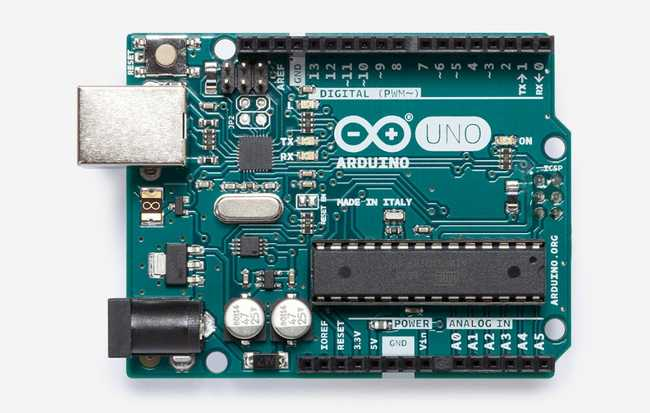
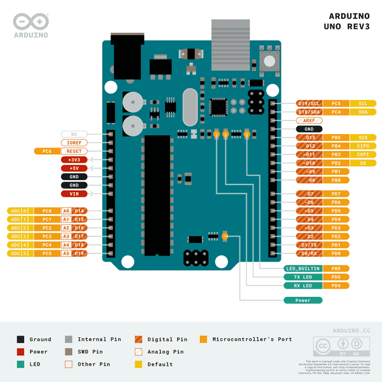
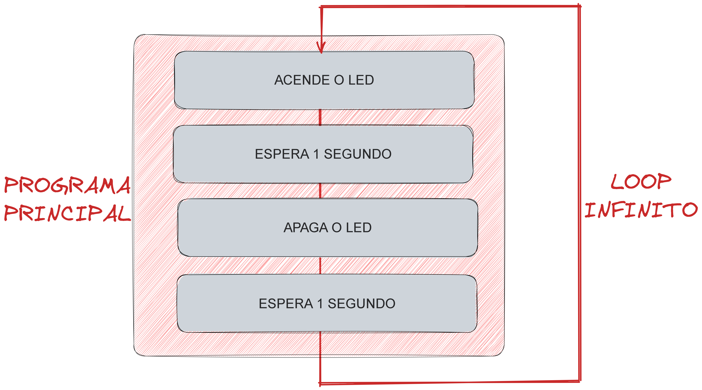

## Conceitos básicos e introdutórios

A programação arduino não é complicada, vou apresentar alguns conceitos importante relacionados a software, ferramentas e hardware para te ajudar a embarcar nesse universo.

## Placa Arduino

Existem diversas placas e versões de Arduinos, vamos trabalhar com o mais simples e famoso, o Arduino UNO. Essa placa possui pinos que podem ser configurados como entradas e saidas para sensores atuadores ou para comunicação com outros sistemas de hardwares, como mostra a figura:



1. Microcontrolador - este é o cérebro de um Arduino, é nele que carregamos os programas. Pense nisso como um minúsculo computador, projetado para executar apenas um número específico de coisas.
2. Porta USB - usada para conectar sua placa Arduino a um computador.
3. Chip USB para Serial - o USB para Serial, responsável por fazer a conversão de protocolos, é um componente importante, pois é o que torna possível programar e comunicar a placa Arduino a partir do seu computador. 
4. Pinos digitais - pinos que usam lógica digital (0,1 ou LOW/HIGH). Comumente usado para chaves e para ligar/desligar um LED.
5. Pinos analógicos - pinos que podem ler valores analógicos em uma resolução de 10 bits (0-1023).
6. Pinos de 5V / 3,3V - esses pinos são usados para alimentar (energia) componentes externos.
7. GND - também conhecido como terra, negativo, Ground, é utilizado para completar um circuito, onde o nível elétrico está em 0 volt.
8. VIN - significa Voltage In, onde você pode conectar fontes de alimentação externas.

## Pinagem

A placa do Arduino UNO possui 14 pinos que podem ser configurados como Entrada/Saida (INPUT/OUTPUT) Digitai, 6 pinos de entrada Analogica com resolução de 10 bits, Alguns pinos podem ser configurados para funções especificas como Serial, PWM, SPI, TWI(I2C), ISR entre outros...   




## Software Embarcado

O software embarcado é o programa que define o funcionamento de um sistema embarcado, ou sejá, é o código que fica gravado no chip do Arduino. Ele é projetado para executar tarefas específicas, com um alto grau de eficiência e confiabilidade. De forma geral, a estrutura de um código segue um padrão, que pode ser dividido em três partes principais:

1. Inicialização: Nesta etapa, o código realiza a configuração inicial dos periféricos, como sensores e atuadores, e estabelece a comunicação com outros dispositivos ou sistemas. Isso inclui a configuração de pinos de entrada e saída, taxas de comunicação, entre outros, no Arduino inclue a "void setup()".
2. Laço de Repetição Infinito: O laço infinito, também conhecido no Arduino como "void loop()", é o coração do software embarcado. Ele é responsável por manter o programa em execução contínua, permitindo que o sistema embarcado execute suas tarefas de forma repetitiva e ininterrupta.
3. Interrupções: As interrupções são eventos que ocorrem de forma assíncrona ao laço infinito, permitindo que o software embarcado responda a eventos externos ou internos, como sinais de sensores ou temporizadores. Esses eventos são geralmente tratados por funções específicas chamadas rotinas de serviço de interrupção (ISR). 

Neste exemplo, a função "setup()" é responsável pela inicialização, enquanto a função "loop()" contém as tarefas a serem executadas repetidamente no laço infinito.

```c
int led = 13;

void setup(){
    pinMode(led,OUTPUT);
}
    
void loop(){
    digitalWrite(led, HIGH); 
    delay(1000); 
    digitalWrite(led, LOW); 
    delay(1000); 
}
```
A representação deste programa pode ser visualizada na figura abaixo: 



Para saber mais desse exemplo acesse: ``Laboratório -> IoT e Sistemas Embarcados --> Blink led``


## A linguagem arduino

A linguagem Arduino é propria MAS é baseada em C/C++ e simplifica a programação de microcontroladores através de um ambiente de desenvolvimento integrado (IDE) amigável e de fácil acesso.

Agumas semelhanças com as linguagens C/C++ (e outras tambem...) são:

 - Sintaxes e Estrutura básica: A estrutura básica do código Arduino, incluindo a definição de funções, variáveis, constantes e operadores, é semelhante à encontrada em C e C++.

 - Funções e bibliotecas: A linguagem Arduino permite a utilização de funções e bibliotecas padrão de C/C++, além de bibliotecas específicas para Arduino.

 - Ponteiros e alocação de memória: Assim como em C e C++, a linguagem Arduino permite o uso de ponteiros e a manipulação de memória, embora esses recursos sejam menos comuns em projetos de Arduino devido à sua complexidade e aos recursos limitados dos microcontroladores.

## Entendo elementos básicos de código

De forma geral a programação de sistemas embarcados envolve o desenvolvimento de aplicações que interagem com o mundo físico através de sensores e atuadores. Para compreender e dominar essas interações, é crucial aprender sobre os conceitos fundamentais, como Entrada e Saída Digital, Debounce de botão Digital, Entrada e Saída Analógica, Interrupção Externa e Interfaces de comunicação como UART/I2C/SPI (Comunicação Serial).

### Saída Digital

A saída digital é uma forma básica de comunicação com componentes externos, como LEDs e relés. Os pinos de saída digital podem ser configurados para atuar como fonte ou dreno de corrente, dependendo da necessidade do circuito. Os sinais são transmitidos como valores discretos, geralmente ``0 (LOW) e 1 (HIGH)``. No Arduino, é possível configurar os pinos de entrada/saída como saída digital usando a função pinMode() e controlar o estado do pino usando a função ``digitalWrite()``.

??? note "Dica"
    Veja o lab Blink led
 
### Entrada Digital

A entrada digital permite que um microcontrolador leia sinais digitais externos, geralmente ``0 (LOW) e 1 (HIGH)``. No Arduino, os pinos de entrada/saída podem ser configurados como entrada digital usando a função pinMode() e ler o estado do pino com a função ``digitalRead()``.

??? note "Dica"
    Veja o lab Led botão

### Entrada Analógica

A conversão de sinais analógicos em valores digitais é realizada por um conversor analógico-digital (ADC) presente no microcontrolador. O ADC possui uma resolução específica, geralmente 10 bits no Arduino UNO, que determina a quantidade de valores possíveis para representar o sinal analógico.

??? note "Dica"
    Veja o lab Botão pod led

### PWM (Saída "Analógica")

A técnica PWM permite controlar a energia entregue a dispositivos externos através da variação do tempo de ativação do sinal digital. A frequência do sinal PWM é geralmente fixa, enquanto o duty cycle (razão entre o tempo de ativação e o período do sinal) varia entre 0 e 100%. No Arduino UNO esse valor é definido em 8bits, ou seja, de 0 até 255.

??? note "Dica"
    Veja o lab PWM


### Interrupção Externa

As interrupções externas podem ser configuradas para serem disparadas em diferentes condições, como mudança de estado, nível alto ou baixo e bordas de subida ou descida. Ao ser disparada, a interrupção executa a rotina de tratamento de interrupção, interrompendo temporariamente o fluxo principal do programa.

??? note "Dica"
    Veja o lab Interrupção de pino

### O uso de delay em sistemas embarcados 

Evitar delays é fundamental para garantir o bom funcionamento e a eficiência do sistema embarcado. O uso excessivo de delays pode resultar em um desempenho inadequado e na incapacidade de responder a eventos em tempo real. Ao invés de utilizar a função delay(), opte por utilizar millis() e técnicas de programação não bloqueantes para criar temporizações.

??? note "Dica"
    Veja o lab Função millis    

### UART (Comunicação Serial)

UART (Universal Asynchronous Receiver-Transmitter) é um protocolo de comunicação serial que permite a transmissão de dados entre dispositivos de forma assíncrona, sem a necessidade de um clock de referência compartilhado. No Arduino, a comunicação serial é geralmente implementada usando as funções ``Serial.begin(), Serial.print(), Serial.println() e Serial.read()``.

??? note "Dica"
    Veja o lab Comunicação Serial 

## Referencias

A comunidade Arduino é muito grande e gera muito material de qualidade, é facil encontrar foruns, tutoriais e videos que te auxiliam no aprendizado. De toda a forma, abaixo tem alguns link da documentação oficial que podem te ajudar.

- [https://www.arduino.cc/reference/en/?_gl=1*19zvap6*_ga*MTA5MDMxODM2My4xNjgyNTEwNDg3*_ga_NEXN8H46L5*MTY4MjUyNzkzMS4yLjEuMTY4MjUyODg0Ni4wLjAuMA..](https://www.arduino.cc/reference/en/?_gl=1*19zvap6*_ga*MTA5MDMxODM2My4xNjgyNTEwNDg3*_ga_NEXN8H46L5*MTY4MjUyNzkzMS4yLjEuMTY4MjUyODg0Ni4wLjAuMA..)
- [https://docs.arduino.cc/learn/starting-guide/getting-started-arduino#general](https://docs.arduino.cc/learn/starting-guide/getting-started-arduino#general)
- 
