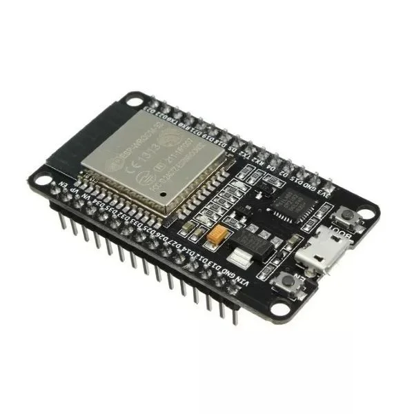

# Introdução ao ESP32

## O que é o ESP32?

O ESP32 é um microcontrolador de baixo custo e baixo consumo de energia que integra Wi-Fi e Bluetooth em um único chip. Desenvolvido pela Espressif Systems, o ESP32 se tornou um dos componentes mais populares para projetos de Internet das Coisas (IoT) devido à sua versatilidade e poder computacional.



## Características Principais

- **Processador**: Dual-core Tensilica Xtensa LX6 de 32 bits (até 240MHz)
- **Memória**: 520 KB de SRAM
- **Conectividade**: Wi-Fi 802.11 b/g/n (2.4 GHz) e Bluetooth 4.2 (BLE)
- **GPIO**: Até 36 pinos
- **Periféricos**: ADC, DAC, I²C, SPI, UART, CAN, PWM, etc.
- **Segurança**: Criptografia por hardware

## Diferenças entre ESP32 e Arduino

| Característica | ESP32 | Arduino UNO |
|----------------|-------|-------------|
| Processador | Dual-core 32-bit até 240MHz | Single-core 8-bit 16MHz |
| Memória RAM | 520 KB | 2 KB |
| WiFi | Integrado | Necessita shield |
| Bluetooth | Integrado | Necessita shield |
| GPIO | Até 36 pinos | 14 pinos digitais, 6 analógicos |
| Preço | $3-$10 | $20-$25 |

## Modelos Comuns de ESP32

1. **ESP32-DevKitC**: Placa de desenvolvimento básica
2. **ESP32-WROOM-32**: Módulo com antena PCB integrada
3. **ESP32-WROVER**: Módulo com antena externa e memória PSRAM adicional
4. **TTGO T-Display**: ESP32 com display LCD colorido
5. **M5Stack**: ESP32 em formato modular com display e sensores

## Por que usar ESP32 para IoT?

- **Conectividade Integrada**: WiFi e Bluetooth prontos para uso
- **Baixo Consumo**: Modos de deep sleep para aplicações com bateria
- **Alto Desempenho**: Processador dual-core permite aplicações mais complexas
- **Baixo Custo**: Excelente custo-benefício para projetos IoT
- **Ecossistema Rico**: Ampla comunidade e muitas bibliotecas disponíveis

---

## Adicionando Suporte ao ESP32 na IDE do Arduino

### Método 1: Usando o Gerenciador de Placas da IDE do Arduino V2.x

1. Abra a IDE do Arduino
2. Vá para **Ferramentas > Placa > Gerenciador de Placas**
3. Pesquise por "esp32"
4. Instale o pacote "ESP32 by Espressif Systems"


## Testando a Instalação

1. Conecte sua placa ESP32 ao computador via USB
2. Na IDE do Arduino, selecione:
   - **Ferramentas > Placa > ESP32 Arduino > [Seu modelo de ESP32]**
   - **Ferramentas > Porta > [Porta COM onde o ESP32 está conectado]**

3. Abra um exemplo simples:
   - **Arquivo > Exemplos > 01.Basics > Blink**

4. Modifique o código para usar o LED interno do ESP32 (pino 2 na maioria das placas):

```cpp
// LED_BUILTIN pode não funcionar para ESP32, use o pino 2 diretamente
void setup() {
  pinMode(2, OUTPUT);
}

void loop() {
  digitalWrite(2, HIGH);
  delay(1000);
  digitalWrite(2, LOW);
  delay(1000);
}
```

5. Clique no botão "Carregar" (a seta para a direita)
6. Aguarde a compilação e o upload
7. Verifique se o LED na placa está piscando

### Falha na comunicação durante upload

Se você receber um erro de comunicação, tente o seguinte:

- Mantenha pressionado o botão "BOOT" durante o início do upload
- Em algumas placas, é necessário pressionar o botão "RESET" após iniciar o upload

----

## Conectando o ESP32 a uma Rede WiFi

Conectando o ESP32 a redes WiFi, implementar um servidor web simples, realizar requisições HTTP e trabalhar com serviços online.

### Código Básico de Conexão WiFi

```cpp
#include <WiFi.h>

const char* ssid     = "SuaRedeWiFi";
const char* password = "SuaSenhaWiFi";

void setup() {
  Serial.begin(115200);
  delay(10);

  // Mensagem inicial
  Serial.println();
  Serial.println("Conectando a:");
  Serial.println(ssid);

  // Inicia a conexão WiFi
  WiFi.begin(ssid, password);

  // Aguarda a conexão
  while (WiFi.status() != WL_CONNECTED) {
    delay(500);
    Serial.print(".");
  }

  // Conexão estabelecida
  Serial.println("");
  Serial.println("WiFi conectado");
  Serial.println("Endereço IP: ");
  Serial.println(WiFi.localIP());
}

void loop() {
  // Verifica periodicamente o status da conexão
  if (WiFi.status() != WL_CONNECTED) {
    Serial.println("Conexão WiFi perdida. Reconectando...");
    WiFi.begin(ssid, password);
    
    while (WiFi.status() != WL_CONNECTED) {
      delay(500);
      Serial.print(".");
    }
    
    Serial.println("Reconectado ao WiFi");
  }
  
  delay(30000); // Verifica a cada 30 segundos
}
```
---