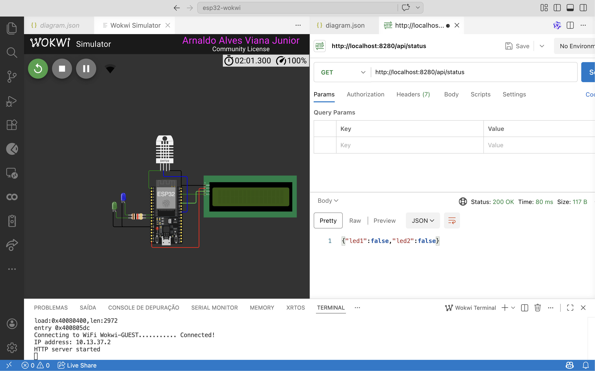
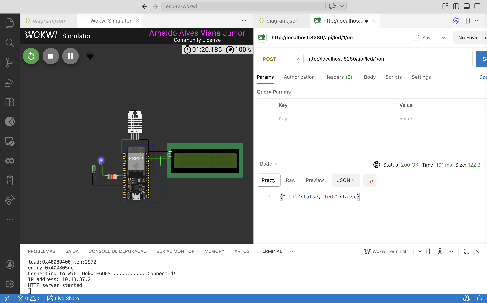

## API REST com ESP32

## Visão geral da aula

Na aula anterior, o ESP32 foi utilizado como um **WebServer com interface HTML**, permitindo controlar LEDs pelo navegador. Nesta aula, a proposta é **transformar esse mesmo projeto em uma API REST**, para que possam interagir com o sistema por meio de um cliente HTTP, como o **Postman**.

A mudança principal não está no hardware, mas na **arquitetura da aplicação**.

- Antes: o ESP32 servia **páginas HTML**.
- Agora: o ESP32 servirá **dados em JSON**.

## Conexão com a aula anterior

Na aula 1, o código foi excelente para introduzir o conceito de servidor web embarcado. No entanto, ele **não é uma API REST propriamente dita**, porque:

- retorna **HTML**, não JSON;
- foi pensado para interação humana no navegador;
- usa uma rota de ação (`/toggle/...`), e não uma modelagem orientada a recursos;
- mistura interface visual e lógica de controle na mesma resposta.

A ideia central é a seguinte:

> **Na aula anterior, o ESP32 servia interface. Agora, ele passa a servir dados.**

---

## O que é uma API REST neste contexto

Vamos trabalhar com uma definição prática e didática.

Uma API REST, é uma aplicação que:

- expõe **rotas HTTP**;
- recebe requisições com métodos como `GET` e `POST`;
- representa o estado do sistema por meio de **recursos**;
- responde com **JSON**;
- pode ser testada por outra aplicação, como o **Postman**.

Não é necessário aprofundar em todas as formalidades da arquitetura REST. O objetivo da aula é compreender a mudança de modelo:

## Recursos que serão expostos na API

Nesta versão da aula, a API será responsável por expor o estado de dois LEDs e permitir seu acionamento.


## Preparando o projeto

Clone o repositório do projeto para acessar o código-fonte do servidor web básico `esp32-webserver-wokwi`:

```bash
git clone https://github.com/arnaldojr/esp32-wokwi
cd esp32-wokwi/webserver-api
code .
```

Agora, abra o arquivo `webserver-api.ino`.

---

## Código-base

```cpp
#include <WiFi.h>
#include <WiFiClient.h>
#include <WebServer.h>
#include <uri/UriBraces.h>

#define WIFI_SSID "Wokwi-GUEST"
#define WIFI_PASSWORD ""
#define WIFI_CHANNEL 6

WebServer server(80);

const int LED1 = 26;
const int LED2 = 27;

bool led1State = false;
bool led2State = false;

String boolToJson(bool value) {
  return value ? "true" : "false";
}

void sendJsonStatus() {
  String response = "{";
  response += "\"led1\":" + boolToJson(led1State) + ",";
  response += "\"led2\":" + boolToJson(led2State);
  response += "}";

  server.send(200, "application/json", response);
}

void sendJsonLedResponse(int ledNumber, bool state) {
  String response = "{";
  response += "\"ok\":true,";
  response += "\"led\":" + String(ledNumber) + ",";
  response += "\"state\":" + boolToJson(state);
  response += "}";

  server.send(200, "application/json", response);
}

void sendJsonError(String message, int code = 400) {
  String response = "{";
  response += "\"ok\":false,";
  response += "\"error\":\"" + message + "\"";
  response += "}";

  server.send(code, "application/json", response);
}

void setup(void) {
  Serial.begin(115200);

  pinMode(LED1, OUTPUT);
  pinMode(LED2, OUTPUT);

  digitalWrite(LED1, LOW);
  digitalWrite(LED2, LOW);

  WiFi.begin(WIFI_SSID, WIFI_PASSWORD, WIFI_CHANNEL);
  Serial.print("Connecting to WiFi ");
  Serial.print(WIFI_SSID);

  while (WiFi.status() != WL_CONNECTED) {
    delay(100);
    Serial.print(".");
  }

  Serial.println(" Connected!");
  Serial.print("IP address: ");
  Serial.println(WiFi.localIP());

  server.on("/api/status", HTTP_GET, []() {
    sendJsonStatus();
  });

  server.on(UriBraces("/api/led/{}/{}"), HTTP_POST, []() {
    String led = server.pathArg(0);
    String action = server.pathArg(1);

    int ledNumber = led.toInt();

    if (ledNumber != 1 && ledNumber != 2) {
      sendJsonError("LED invalido", 404);
      return;
    }

    if (action != "on" && action != "off") {
      sendJsonError("Acao invalida", 400);
      return;
    }

    bool newState = (action == "on");

    if (ledNumber == 1) {
      led1State = newState;
      digitalWrite(LED1, led1State);
      sendJsonLedResponse(1, led1State);
    } else {
      led2State = newState;
      digitalWrite(LED2, led2State);
      sendJsonLedResponse(2, led2State);
    }
  });

  server.onNotFound([]() {
    sendJsonError("Rota nao encontrada", 404);
  });

  server.begin();
  Serial.println("HTTP server started");
}

void loop(void) {
  server.handleClient();
  delay(2);
}
```

---

## Explicação do código

### 1. Conexão com o Wi-Fi

O ESP32 conecta-se à rede configurada e imprime o endereço IP no Serial Monitor.

Esse IP será utilizado no Postman para testar os endpoints.

Exemplo:

```text
http://localhost:8280/api/status
```

---

### 2. Estado do sistema

Os LEDs possuem variáveis de estado:

```cpp
bool led1State = false;
bool led2State = false;
```

Essas variáveis representam o estado lógico dos recursos controlados pela API.

---

### 3. Resposta JSON

Em vez de responder HTML com `text/html`, agora o servidor responde:

```cpp
server.send(200, "application/json", response);
```

Esse é um ponto fundamental da mudança de arquitetura.

---

### 4. Endpoint de consulta

```http
GET /api/status
```

Esse endpoint não altera o sistema. Ele apenas consulta o estado atual.

---

### 5. Endpoint de controle

```http
POST /api/led/{id}/{acao}
```

Exemplos:

```http
POST /api/led/1/on
POST /api/led/1/off
POST /api/led/2/on
POST /api/led/2/off
```

Esse endpoint altera o estado do sistema, por isso foi modelado com `POST`.

---

## Testando no Postman

### Passo 1 — Descobrir o IP do ESP32

Abrir o **Serial Monitor** e observar o IP impresso após a conexão com a rede.

Exemplo:

```text
IP address: localhost:8280
```

---

### Passo 2 — Fazer a requisição `GET`

Método:

```text
GET
```

URL:

```text
http://localhost:8280/api/status
```

Resposta esperada:

```json
{
  "led1": false,
  "led2": false
}
```

---

### Passo 3 — Ligar um LED

Método:

```text
POST
```

URL:

```text
http://localhost:8280/api/led/1/on
```

Resposta esperada:

```json
{
  "ok": true,
  "led": 1,
  "state": true
}
```

---

### Passo 4 — Desligar um LED

Método:

```text
POST
```

URL:

```text
http://localhost:8280/api/led/1/off
```

---

### Passo 5 — Testar erros

Exemplo de LED inválido:

```text
POST http://localhost:8280/api/led/3/on
```

Resposta esperada:

```json
{
  "ok": false,
  "error": "LED invalido"
}
```

Exemplo de rota inexistente:

```text
GET http://localhost:8280/api/teste
```

Resposta esperada:

```json
{
  "ok": false,
  "error": "Rota nao encontrada"
}
```


## Desafio

Adicionar um sensor de temperatura e umidade à API REST.

o código de exemplo para usar o sensor DHT22 é o seguinte:

```bash
https://wokwi.com/projects/322410731508073042
```

### Objetivo

Fazer com que o ESP32 não apenas controle atuadores, mas também exponha dados de sensores por meio de um endpoint HTTP.

### Requisito mínimo
Criar um endpoint semelhante a:

```http
GET /api/temphum
```

### Resposta esperada


```json
{
  "temperature_c": 24.7,
  "humidity": 55.2
}
```
