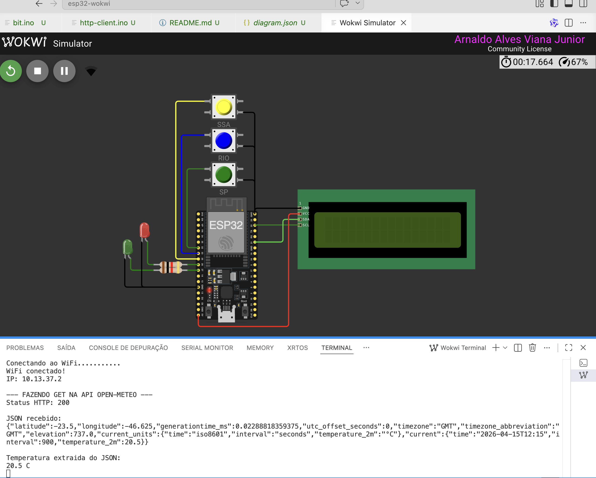

## HTTPClient

## Visão geral da aula

Ja sabemos servir páginas e aplicações **web embarcadas**. Nesta aula, a proposta muda de direção: em vez de o ESP32 **servir páginas ou dados para outros clientes**, ele passará a atuar como **cliente HTTP**, consumindo APIs disponíveis na internet.


O objetivo desta aula é apresentar o uso da classe `HTTPClient`, mostrando como o ESP32 pode:

- realizar requisições `GET` em APIs reais;
- extrair e interpretar informações específicas de um objeto JSON.


## O que é um cliente HTTP

Neste primeiro momento, não serão utilizados botão, LCD ou outras camadas de hardware. A ideia é concentrar o aprendizado no essencial:

> **Como o ESP32 conversa com APIs HTTP usando a classe `HTTPClient`.**

Vamos trabalhar com uma definição prática e didática.

Um cliente HTTP é uma aplicação capaz de:

- abrir uma conexão com um servidor;
- enviar uma requisição HTTP;
- informar um método como `GET`;
- receber a resposta enviada pelo servidor;
- interpretar o conteúdo retornado, geralmente em JSON.

## APIs utilizadas 

### 1. Open-Meteo

A Open-Meteo é uma API de clima que:

- é pública;
- não exige chave de API;
- responde em JSON;
- permite solicitar apenas os campos desejados;
- possui um endpoint de previsão que aceita `latitude`, `longitude` e o parâmetro `current` para retornar variáveis atuais, como `temperature_2m`.


## Preparando o projeto

Clone o repositório do projeto para acessar o código-fonte do servidor web básico `http-client`:

```bash
git clone https://github.com/arnaldojr/esp32-wokwi
cd esp32-wokwi/http-client
code .
```

Agora, abra o arquivo `http-client.ino`.

---

## Exemplo 1 — Requisição GET com Open-Meteo

Fazer com que o ESP32:

1. conecte-se ao Wi-Fi;
2. envie uma requisição `GET` para a API Open-Meteo;
3. receba a resposta em JSON;
4. extraia o campo `current.temperature_2m`;
5. exiba o valor no Serial Monitor.

### Código-base

```cpp
#include <WiFi.h>
#include <HTTPClient.h> // Biblioteca para realizar requisições HTTP
#include <ArduinoJson.h> // Biblioteca para interpretar JSON

// =========================
// CONFIGURACAO DO WIFI
// =========================
#define WIFI_SSID "Wokwi-GUEST"
#define WIFI_PASSWORD ""
#define WIFI_CHANNEL 6

// =========================
// URL DA API
// =========================
// Temperatura atual de Sao Paulo
const char* WEATHER_URL =
  "https://api.open-meteo.com/v1/forecast?latitude=-23.55&longitude=-46.63&current=temperature_2m";  // ponteiro para a URL da API de clima

// =========================
// Variaveis
// ========================
unsigned long lastRequestTime = 0;
const unsigned long REQUEST_INTERVAL = 10000;

// =========================
// CONECTA NO WIFI
// =========================
void connectWiFi() {
  WiFi.begin(WIFI_SSID, WIFI_PASSWORD, WIFI_CHANNEL);

  Serial.print("Conectando ao WiFi");

  while (WiFi.status() != WL_CONNECTED) {
    delay(100);
    Serial.print(".");
  }

  Serial.println();
  Serial.println("WiFi conectado!");
  Serial.print("IP: ");
  Serial.println(WiFi.localIP());
}

void ensureWiFiConnected() {
  if (WiFi.status() != WL_CONNECTED) {
    Serial.println("WiFi desconectado. Tentando reconectar...");
    connectWiFi();
  }
}


// =========================
// FAZ A REQUISICAO GET
// =========================
void makeGetRequest() {
  HTTPClient http;  // Cria um objeto HTTPClient para gerenciar a requisição

  Serial.println("\n--- FAZENDO GET NA API OPEN-METEO ---");
  http.begin(WEATHER_URL);  // inicia a conexão com a URL da API

  int httpCode = http.GET();  // Envia a requisição GET e armazena o código de status HTTP retornado pelo servidor

  Serial.print("Codigo do Status HTTP: ");
  Serial.println(httpCode);

  if (httpCode <= 0) {
    Serial.println("Erro na requisicao");
    http.end();
    return;
  }

  String payload = http.getString(); // Lê o corpo da resposta da API como uma string
  http.end();  // Encerra a conexão HTTP, muito importante para liberar recursos e evitar conexões pendentes, se esquecer de chamar http.end(), o ESP32 pode ficar sem memória ou com conexões abertas demais, causando falhas em requisições futuras.

  Serial.println("\nJSON recebido:");
  Serial.println(payload);  // Exibe o JSON bruto recebido da API, útil para entender a estrutura da resposta e verificar se os dados estão corretos


  // Parse do JSON usando ArduinoJson
  DynamicJsonDocument doc(2048);    // Cria um documento JSON dinâmico com capacidade de 2048 bytes para armazenar a resposta da API
  DeserializationError error = deserializeJson(doc, payload);   // Tenta interpretar a string JSON e armazenar a estrutura resultante no objeto 'doc'. Se o JSON estiver malformado ou exceder a capacidade do documento, 'error' conterá detalhes sobre o problema.

  if (error) {
    Serial.print("Erro ao interpretar JSON: ");
    Serial.println(error.c_str());
    return;
  }

  JsonVariant temperatureNode = doc["current"]["temperature_2m"];  // Navega na estrutura JSON para acessar o campo 'current.temperature_2m', que contém a temperatura atual a 2 metros de altura. O resultado é armazenado em 'temperatureNode' como um JsonVariant, que pode conter diferentes tipos de dados (número, string, etc.). pode ser JsonObject, JsonArray, JsonVariant, dependendo da estrutura do JSON e do campo acessado.

  if (temperatureNode.isNull()) {
    Serial.println("Campo current.temperature_2m nao encontrado");
    return;
  }

  float temperatureC = temperatureNode;  // converte pra float.

  Serial.println("\nTemperatura extraida do JSON:");
  Serial.print(temperatureC, 1);
  Serial.println(" C");
}

void setup() {
  Serial.begin(115200);

  connectWiFi();
  makeGetRequest();
}

void loop() {
  unsigned long now = millis();

  if (now - lastRequestTime >= REQUEST_INTERVAL) {
    lastRequestTime = now;

    ensureWiFiConnected();
    makeGetRequest();
  }
}
```

---

## Explicação do código GET

### Endpoint da API

```cpp
const char* WEATHER_URL =
  "https://api.open-meteo.com/v1/forecast?latitude=-23.55&longitude=-46.63&current=temperature_2m";
```

Essa URL contém:

- o endpoint da API;
- a latitude e longitude do local desejado;
- o parâmetro `current=temperature_2m`, que pede a temperatura atual a 2 metros de altura.

Este é um ponto importante para a leitura da URL: em APIs baseadas em parâmetros, cada parte da query string altera o tipo de informação que será retornada.


### Criação do cliente HTTP

```cpp
HTTPClient http;
```

Esse objeto será responsável por:

- abrir a conexão com o servidor;
- enviar a requisição;
- receber a resposta;
- encerrar a conexão.

### 6. Definição da URL na requisição

```cpp
http.begin(WEATHER_URL);
```

O método `begin()` informa ao cliente HTTP para qual endereço a requisição será enviada.

### Envio do método GET

```cpp
int httpCode = http.GET();
```

Aqui ocorre o envio efetivo da requisição `GET`.

O retorno desse método é o código de status HTTP recebido do servidor. Alguns exemplos clássicos:

- `200` → sucesso;
- `404` → recurso não encontrado;
- `500` → erro interno do servidor.


### Leitura da resposta

```cpp
String payload = http.getString();
```

Esse comando obtém o corpo da resposta retornada pela API, armazenando-o em formato de texto.

### Encerramento da conexão

```cpp
http.end();
```

`Esse ponto é importante`. Após concluir a requisição, devemos encerrar a conexão associada ao objeto `HTTPClient`.

!!! warning
    Esquecer de chamar `http.end()` pode levar a problemas de memória e conexões pendentes, especialmente em dispositivos com recursos limitados como o ESP32.


### Interpretação do JSON

```cpp
DynamicJsonDocument doc(2048);
DeserializationError error = deserializeJson(doc, payload);
```

Aqui, o texto retornado pela API é convertido em uma estrutura JSON navegável pelo programa.

### Acesso ao campo desejado

```cpp
JsonVariant temperatureNode = doc["current"]["temperature_2m"];
```

Esse trecho navega na estrutura JSON até encontrar o campo desejado.

A resposta da API possui um formato semelhante a este:

```json
{
  "latitude": -23.55,
  "longitude": -46.63,
  "generationtime_ms": 0.03,
  "utc_offset_seconds": 0,
  "timezone": "GMT",
  "timezone_abbreviation": "GMT",
  "elevation": 760.0,
  "current_units": {
    "temperature_2m": "°C"
  },
  "current": {
    "temperature_2m": 22.4
  }
}
```

O campo que nos interessa está dentro do objeto `current`.


### Conversão para `float`

```cpp
float temperatureC = temperatureNode;
```

Depois de localizar o valor, ele é convertido para o tipo `float`, permitindo seu uso em cálculos, comparações e exibição formatada.


## Testando o exemplo GET

### executar o código

Compile o código no Arduino IDE (export o binario compilado) e execute o programa no Wokwi. 

### observar a resposta bruta e o valor extraído

O programa exibirá o JSON retornado pela API, permitindo visualizar a estrutura real da resposta.

Em seguida, será exibida a temperatura extraída do campo:

```text
current.temperature_2m
```



## Desafio 1

Altere a URL da Open-Meteo para também solicitar:

- umidade relativa;
- velocidade do vento.

Depois, extraia esses campos do JSON e exiba os valores no Serial Monitor.

## Desafio 2

Troque as coordenadas da URL para consultar a temperatura atual de outra cidade.

## Desafio 3

Exiba as informações de temperatura, umidade e vento em um LCD 16x2 conectado ao ESP32.

Dica: utilize o código-base abaixo para exibir as informações no LCD

```cpp
#include <LiquidCrystal_I2C.h>
LiquidCrystal_I2C lcd(0x27, 16, 2); // Endereço I2C do LCD, número de colunas e linhas


void setup() {

  lcd.init(); // Inicializa o LCD
  lcd.backlight(); // Liga a luz de fundo do LCD

}

void exibeDadosNoLCD(float temperatura, float umidade, float vento) {
  lcd.clear(); // Limpa o LCD antes de exibir novos dados
  lcd.setCursor(0, 0); // Define o cursor para a primeira linha
  lcd.print("Temp: ");
  lcd.print(temperatura, 1); // Exibe a temperatura com 1 casa decimal
  lcd.print(" C");

  lcd.setCursor(0, 1); // Define o cursor para a segunda linha
  lcd.print("Umid: ");
  lcd.print(umidade, 1); // Exibe a umidade com 1 casa decimal
  lcd.print("% Vento: ");
  lcd.print(vento, 1); // Exibe a velocidade do vento com 1 casa decimal
  lcd.print(" km/h");
}

``` 

## Desafio 4

Adicione um botão ao circuito. Quando o botão for pressionado, o ESP32 deve realizar uma nova requisição `GET` para a API e atualizar as informações exibidas no LCD.


## desafio 5

Adicione mais dois botões ao circuito. Cada botão deve realizar uma requisição `GET` para uma cidade diferente, permitindo alternar entre as informações de clima de duas localidades distintas.