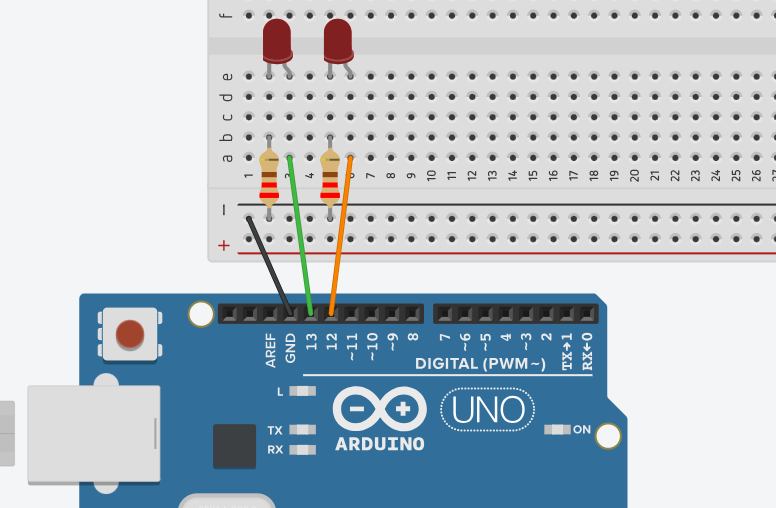

## Lab1 - Desafios

Os desafios 1, 2 e 3 devem ser entregues e compõem parte da nota do CP6.

## Desafio 1

Com base no exemplo **Blink led**, faça:

Monte um circuito com 2 LEDs, usando como referência a imagem acima. Escreva um código que faça os LEDs piscarem de forma síncrona a cada 0,5 segundos.

## Desafio 2

Agora, faça os LEDs acenderem conforme a carta de tempo abaixo. Onde:

1 = nível lógico alto (HIGH)

0 = nível lógico baixo (LOW)

delay = 500ms

## Desafio 3

Utilizando o **Buzzer**, faça seu nome em Código Morse. Use como referência a tabela abaixo.

