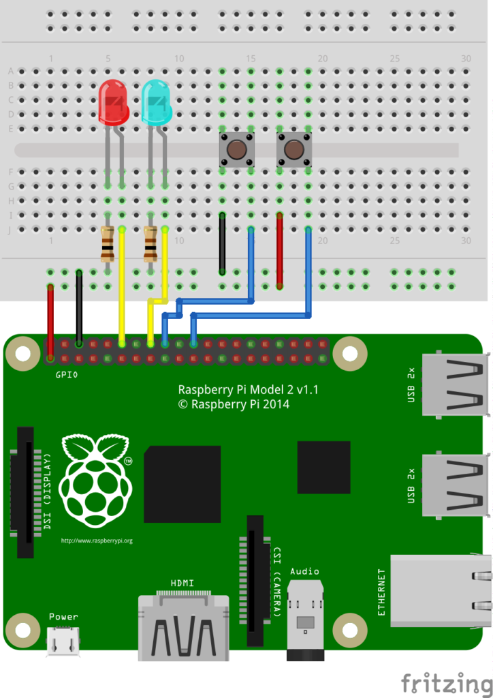

## O que vamos ver neste lab?

- Raspberry Pi: 
    - Conhecendo os pinos
    - Usando a biblioteca RPI.GPIO 
    - Montando um Webserver em Flask 


!!! progress
    Continuar...


## Conhecendo os pinos da Raspberry Pi

Podemos utilizar a Raspberry Pi para conectar sensores e atuadores, de forma semelhante como foi feito utilizando o Arduino, para isso utilizamos os barramento de pinos da Raspberry Pi chamado de GPIO (General Purpose Input Output). Ao todo são 40 pinos (para RPI 2 ou superior) e de forma geral cada pino possui uma função ou caracteristica especifica.

!!! Warning
    Cuidado: Devemos ter atenção para não conectar os perifericos na placa de forma incorreta. Existe risco de queimar a Raspberry Pi.  

A imagem abaixo é um guia simples para cada pino. Parece complicado na primeira vez, mas é tranquilo.


Vamos conhecer o que é cada pino:

    - Pinos de Alimentação: 
        - 3.3V (ao todo 2 pinos)
        - 5V (ao todo 2 pinos)
        - GND/Ground/0V (ao todo 8 pinos)
    
    - Pinos de interface:
        - GPIO (General purpose input and output): São os pinos de entrada/saida. A tensão de saida é de 3.3V.
        - I2C/SPI/UART: Protocolos de comunicação especificos utilizados para realizar a interface módulos epecificos com a Raspberry Pi.
 
!!! Warning
    Atenção: Observe a correlação dos pinos para não ligar invertido.
    
     

!!! exercise
    Quantos pinos GPIO estão disponiveis?


!!! progress
    Continuar...


## Configurando os GPIOs

No final do lab07 montamos um simples pisca led e programamos configurando os valores dos registradores. Existem formas mais simples de programar os GPIOs da rasbperry pi, vamos programar em Python :) 

Vamos utilizara biblioteca ``RPI.GPIO``, que permite de forma simples configurar e usar os GPIOs com script em Python, vamos preparar o nosso ambiente de desenvolvimento:

!!! exercise
    - Inicialize a Raspberry Pi. (modo Desktop ou SSH).

        - Se tiver dúvida de como fazer, volte para o lab07.
        
    - Abra o terminal da raspberry pi.

    - Certifique-se de estar com acesso a internet.


No terminal da raspberry pi, atualize os repositórios:

```bash

sudo apt update

```   
 
Em seguida, tente instalar o pacote RPi.GPIO: A documentação da biblioteca está disponivel no [aqui](https://pypi.org/project/RPi.GPIO/).

```bash

sudo apt install rpi.gpio

```  

Se ainda não estiver instalado, será instalado. Se já estiver instalado, será atualizado se uma versão mais recente estiver disponível.


!!! progress
    Continuar...


### Conhecendo a biblioteca RPi.GPIO

É uma biblioteca simples de usar e vamos ver as principais funções da RPi.GPIO através do código de exemplo abaixo:

- ``GPIO.setmode()`` = Define o modo de acesso aos pino da raspberry pi, existem 2 modos de definir a mesma coisa:
    
    - GPIO.BOARD  = Posição física do pino na raspberry pi
    - GPIO.BCM    = Numero após GPIOxx

> exemplo:
> BOARD 11 = GPIO17


- ``GPIO.setup()`` = Define a função do pino, entrada (GPIO.IN) ou saida (GPIO.OUT)

- ``GPIO.output()`` = Define o estado do pino definido como saida em nivel logico baixo (GPIO.LOW) ou alto (GPIO.HIGH)

- ``GPIO.input()`` = Faz a leitura do estado do pino definido como entrada. Geralmente quando usamos um pino como entrada configuramos no setup o parametro pull_up_down (como exemplo: GPIO.setup(18, GPIO.IN, pull_up_down=GPIO.PUD_UP))


!!! exercise
    Monte o circuito abaixo:
    
    
    
    - No terminal da RPI, digite:
    
    ```shell
    cd ~
    mkdir src
    cd src
    touch blinkled.py  

    ``` 
    
    - Criamos um diretorio chamado src e um arquivo python chamado blinkled.py
    - Abra o arquivo blinkled.py e escreva o código abaixo.
    - Para abrir o arquivo digite: nano blinkled.py
    - Após digitar o código python, salve e feche o arquivo: Ctlr+X >>> Y 
    - Vamos rodar nosso código python, no terminal digite:
        * python blinkled.py
    
    - Se tudo deu certo, o led está piscando. :)
        - para interromper o código aperte Ctrl+C.

!!! Warning
    Os 2 códigos realizam a mesma função, a diferença está apenas no **setmode**. Escolha um dos códigos para testar. 

    ```python    
    import RPi.GPIO as GPIO  ### import da biblioteca gpio
    import time

    # usando o a posição fisíca do pino na raspberry pi
    GPIO.setmode(GPIO.BOARD)
     
    # configura o pino fisico 11 como saida
    GPIO.setup(11, GPIO.OUT)

    whille True:  
        # escreve no pino 11 nivel logico alto
        GPIO.output(11, GPIO.HIGH)
        time.sleep(1) # delay de 1s
    
        # escreve no pino 11 nivel logico baixo
        GPIO.output(11, GPIO.LOW)
        time.sleep(1) # delay de 1s

    GPIO.cleanup()  # Limpa configuração finaliza o programa

    ```
    
    ``` python 
    import RPi.GPIO as GPIO  ### import da biblioteca gpio
    
    # usando o numero após GPIOxx da raspberry pi
    GPIO.setmode(GPIO.BCM)
    
    # configura o GPIO17 como saida
    GPIO.setup(17, GPIO.OUT)
    
    whille True:  
        # escreve no GPIO17 nivel logico alto
        GPIO.output(17, GPIO.HIGH)
        time.sleep(1) # delay de 1s
    
        # escreve no GPIO17 nivel logico baixo
        GPIO.output(17, GPIO.LOW)
        time.sleep(1) # delay de 1s

    GPIO.cleanup()  # Limpa configuração finaliza o programa
    
    ```
    
Agora que já entendemos a estrutura básica do script python, faça os exercicios abaixo para praticar


!!! exercise
    Semáfaro de transito: 
    
        - Monte um circuito com 3 leds (1 verde, 1 amarelo, 1 vermelho);
        - crie um novo script chamado semaforo.py;
        - Escreva um código que irá acender os leds na sequência e intervalo:
            - Verde (5segundos)
            - Amarelo (3segundos)
            - Vermelho (6segundos)
            - loop (volta para o verde)

    
!!! exercise
    leitura de botão e Led: 
    
    - Monte o circuito: 

    
    
    - Escreva um código que:
        - Enquanto nenhum botão for pressionado, os leds ficam apagados;
        - Se o botão1 for pressionado:
            - os leds acendem na sequência: Verde - Amarelo - Vermelho
        - Se o botão2 for pressionado:
            - os leds acendem na sequencia: Vermelho - Amarelo - Verde 
    
    > Dica: Geralmente quando usamos algum pino como entrada configuramos no setup o parametro pull_up_down (como exemplo: GPIO.setup(18, GPIO.IN, pull_up_down=GPIO.PUD_UP) ou GPIO.setup(18, GPIO.IN, pull_up_down=GPIO.PUD_DOWN).

!!! exercise
    Sensor de temperatura: Para quem tiver curiosidade pode dar uma olhada como utilizar o sensor de temperatura DTH11 [neste link](https://www.filipeflop.com/blog/raspberry-pi-umidade-e-a-temperatura-com-o-sensor-dht11/).

!!! progress
    Continuar...


## Montando um Webserver em Flask

Vamos montar um webserver na raspberry pi com flask. A ideia deste exemplo é controlar por um navegador web o status de um led entre ligado e desligado:


### Instalando o Flask e configurando o ambiente


No terminal da raspberry pi, atualize os repositórios:

```bash

sudo apt update

```   

Instale os pacotes do flask

```bash

sudo apt-get install python3-flask

```   

Agora vamos criar nossa arvore de projeto:

``` shell
- webserver
    - static
        - index.css
    - templates
        - index.html
    - app.py
```

No terminal da raspberry pi, digite:

```bash
cd ~
mkdir webserver
cd webserver
mkdir static templates
ls

``` 
 
Vamos criar o ``app.py``. No terminal da raspberry pi, digite:

```bash

nano app.py

```  


Com o editor nano aberto digite:

```python
'''
	Arnaldo Viana
'''
import RPi.GPIO as GPIO
from flask import Flask, render_template, request

app = Flask(__name__)

GPIO.setmode(GPIO.BCM)
GPIO.setwarnings(False)

#define actuators GPIOs
ledRed = 2

#initialize GPIO status variables
ledRedSts = 0

# Define led pins as output
GPIO.setup(ledRed, GPIO.OUT)   

# turn leds OFF 
GPIO.output(ledRed, GPIO.LOW)
	
@app.route("/")
def index():
	# Read GPIO Status
	ledRedSts = GPIO.input(ledRed)

	templateData = {
      		'ledRed'  : ledRedSts,
      	}
	return render_template('index.html', **templateData)
	
@app.route("/<deviceName>/<action>")
def action(deviceName, action):
	if deviceName == 'ledRed':
		actuator = ledRed
   
	if action == "on":
		GPIO.output(actuator, GPIO.HIGH)
	if action == "off":
		GPIO.output(actuator, GPIO.LOW)
		     
	ledRedSts = GPIO.input(ledRed)
   
	templateData = {
      		'ledRed'  : ledRedSts,
	}
	return render_template('index.html', **templateData)

if __name__ == "__main__":
   app.run(host='0.0.0.0', port=80, debug=True)

```  


show! Salve e feche o editor nano. Ctrl+X >> Y


Vamos criar a pagina html ``index.html``. No terminal da raspberry pi, digite:

```bash
cd templates
nano index.html

```  

Com o editor nano aberto digite:

```html
<!DOCTYPE html>
   <head>
      <title>Webserver</title>
      <link rel="stylesheet" href='../static/index.css'/>
   </head>

   <body>

		<h2> Controle LED </h2>
		
		<h3> RED LED ==>  {{ ledRed  }}  ==>  
			
				<a href="/ledRed/off"class="button">TURN OFF</a>
			
				<a href="/ledRed/on" class="button">TURN ON</a> 
				
		</h3>
		
   </body>
</html>

```

show! Salve e feche o editor nano. Ctrl+X >> Y

Vamos criar o arquivo de estilo css ``index.css``. No terminal da raspberry pi, digite:

```bash
cd ..
cd static
nano index.html

```  
> Com o editor nano aberto digite:

```css

body {
   background: blue;
   color: yellow;
}

.button {
  font: bold 15px Arial;
  text-decoration: none;
  background-color: #EEEEEE;
  color: #333333;
  padding: 2px 6px 2px 6px;
  border-collapse: separete;
  border-spacing: 0;
  border-top: 1px solid #CCCCCC;
  border-right: 1px solid #333333;
  border-bottom: 1px solid #333333;
  border-left: 1px solid #CCCCCC;
}

```

> show! Salve e feche o editor nano. Ctrl+X >> Y

### Hora de testar

Vamos testar nosso webserver simples.

No terminal da raspberry pi, digite:

```bash
cd ..
sudo python app.py

```  


> Deixe o flask rodando na raspberry e no computador ou no smartphone (Deve estar na mesma rede da raspberry), abra o navegador web e digite o ip da raspberry pi. O resultado esperado é abrir uma pagina web e controlar o led. 

!!! exercise
    Compreenda o código app.py e monte o circuito adequado para conseguir visualizar o led acender e apagar.

 
!!! exercise
    Altere o código app.py e adicione mais 2 led e 2 botões (totalizando 3 leds, 2 botões), lembre-se de adaptar os arquivos HTML para exibir no frontend os status. 


!!! exercise
    Aproveite os seus conhecimentos web e proponha melhorias de UI/UX para o exercicio anterior.

