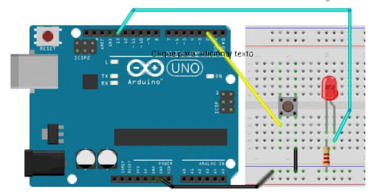
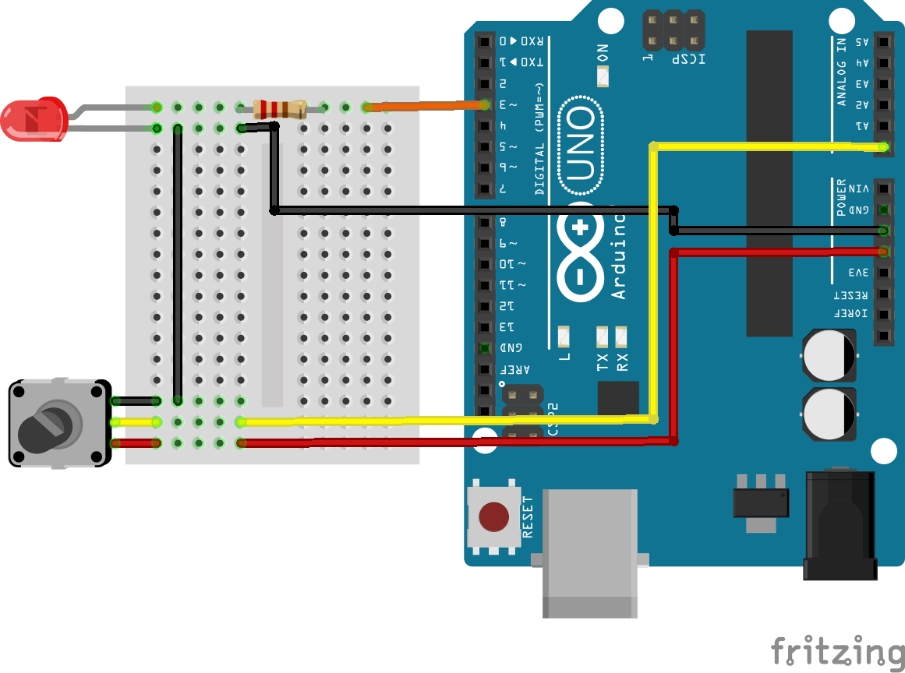

## Lab2 - Desafios


## Desafio 1

Neste desafio vamos explorar como realizar a leitura de um pino digital do arduino, para isso monte o circuito do abaixo e vamos explorar o seu funcionamento:



Use esse código de base:

```C
// const é uma constante. logo o valor não muda
const int buttonPin = 2;
const int ledPin = 13;
// cria uma variável
int buttonState = 0;

void setup() {
    // configura botão no pino do arduino como entrada:
    pinMode(ledPin, OUTPUT);
    // configura botão no pino do arduino como entrada:
    pinMode(buttonPin, INPUT_PULLUP);
}

void loop() {
    // Lê o estado do botão:
    buttonState = digitalRead(buttonPin);
    // se o botão estiver em nível lógico alto
    if (buttonState == LOW) {
        // liga o led
        digitalWrite(ledPin, HIGH);
    } else {
        // apaga o led
        digitalWrite(ledPin, LOW);
        delay(1000);
    }
}

```

1. Rode o código fornecido de base. Observe, entenda e anote o seu funcionamento;
    
    - O que acontece quando pressiona e solta o botão?
    - ○ O que acontece quando pressiona e segura o botão?

!!! warning "Atenção"
    Repare que o funcionamento pode parecer “lento” e às vezes o botão “não responde” como você espera.  
    Isso acontece porque `delay()` **bloqueia o loop** e reduz drasticamente a frequência de leitura.

Showwww agora vamos avançar um pouquinho….

2. Altere o código para funcionar da seguinte forma:

- Ao **pressionar e soltar** o botão (um clique), o LED deve **alternar**:
  - se estava apagado → acende  
  - se estava aceso → apaga  

3. Debounce com millis(): Jeito certo!

Botões mecânicos “tremem” eletricamente ao pressionar/soltar (bounce), causando múltiplas leituras rápidas.  
Vamos implementar debounce com `millis()`.

### Regras 
- Você **não pode** usar `delay()` para debounce.
- Você deve gerar o “evento de clique” **apenas quando a leitura estiver estável** por um tempo mínimo (ex.: 50ms).
- O toggle deve funcionar de forma **consistente**.

Abaixo há um exemplo **parcial** (parte da solução, não a solução completa). Você deve entender e adaptar ao seu código:

```C
const int buttonPin = 2;          // Pino do botão
int lastButtonReading = HIGH;     // Última leitura bruta
int stableButtonState = HIGH;     // Estado estável (após debounce)

unsigned long lastDebounceTime = 0;   // Último tempo que a leitura mudou
unsigned long debounceDelay = 50;     // 50 ms

void setup() {
  pinMode(buttonPin, INPUT_PULLUP);
}

void loop() {
  int reading = digitalRead(buttonPin);

  if (reading != lastButtonReading) {
    lastDebounceTime = millis();
  }

  if ((millis() - lastDebounceTime) > debounceDelay) {
    // aqui você pode considerar reading como "estável"
    if (reading != stableButtonState) {
      stableButtonState = reading;

      if (stableButtonState == LOW) {
        // Evento: botão pressionado (borda estável)
      }
    }
  }

  lastButtonReading = reading;
}
```

---


---

## Desafio 2

Altere o código do **desafio 1** e implemente um log que exibe o status do botão e do led.

!!! tip
    Para conseguir resolver esse desafio, Você deve inicialiar o periferico de comunicação serial. Fazemos isso com a instrução ``Serial.begin(9600);`` dentro da função ``void setup()``.
    
    ```C
    void setup() {
      // Inicia a comunicação serial com uma taxa de 9600 bps
      Serial.begin(9600);
    }
    
    void loop() {
      // Seu código aqui
    }

    ```
    Além disso, depois de usar ``Serial.begin()``, você pode usar a função ``Serial.print()`` ou ``Serial.println()`` para enviar dados pela serial e criar seu log. Para visualizar, use o ``Serial Monitor`` no arduinoIDE clique em ``Ferramentas -> Monitor Serial``

## Desafio 3

Neste desafio vamos explorar novos recursos do arduino. Para isso implemente um código que faz a leitura do pino analogico A0 que altera o tempo de delay do led. Monte o circuito abaixo:




!!! tip
    Vamos conhecer e utilizar as funções do arduino ``analogRead()`` e ``analogWrite()``.
    
    - **analogRead**: A função analogRead é usada para ler valores de sinais analógicos através de pinos analógicos no Arduino. Ela converte a tensão analógica presente no pino em um valor digital que pode variar de 0 a 1023, correspondendo a uma faixa de 0 a 5 volts (no Arduino Uno e outros modelos semelhantes).
        
        ```C
        int analogValue = analogRead(A0); // Lê o valor analógico do pino A0
        
        ```
    - **analogWrite**: A função analogWrite é usada para gerar uma saída PWM (modulação por largura de pulso) em um pino digital. Embora seja chamada de "analogWrite", na verdade ela gera um sinal digital pulsante com diferentes larguras de pulso, simulando uma saída analógica. Ela é frequentemente usada para controlar a intensidade luminosa de LEDs ou a velocidade de motores. 
    
    - Importante destacar que a função ``analogWrite`` funciona apenas em pinos específicos do Arduino que suportam PWM, geralmente marcados com o símbolo ``"~"``.
    
        ```C
        int pwmValue = 128;
        analogWrite(9, pwmValue); // Gera um sinal PWM no pino 9 com ciclo de trabalho de 50%
    
        ```
    - Utilize a função ``map()`` do arduino para fazer a conversão de valores. Pesquise no google essa função.