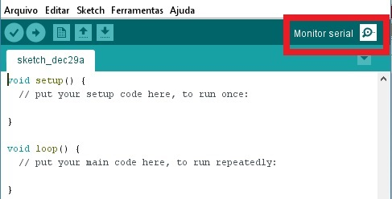
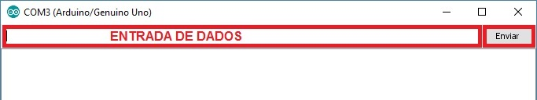
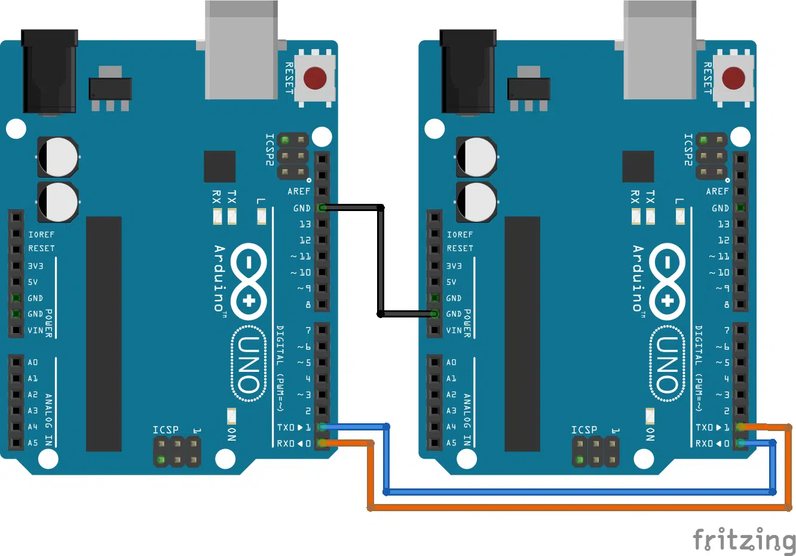

## comunicação serial

A comunicação serial permite que o Arduino se comunique com o computador e outros dispositivos. Neste laboratório, exploraremos a comunicação serial em detalhes.

## Desafio 1: Comunicação entre Arduino e Computador

Neste desafio, vamos estabelecer uma comunicação básica entre o Arduino e o computador usando o Serial Monitor.

Carregue o seguinte código no seu Arduino:

```C
void setup() {
  Serial.begin(9600); // Inicia a comunicação serial a 9600 bps
}

void loop() {
  Serial.println("Olá, Mundo!"); // Envia a mensagem "Olá, Mundo!" para o computador
  delay(1000); // Espera 1 segundo
}

```

- Abra o Serial Monitor no Arduino IDE (Ferramentas -> Monitor Serial).

- Você deve ver a mensagem "Olá, Mundo!" sendo exibida a cada segundo.





!!! tip
    Certifique-se de que a taxa de baud no Serial Monitor esteja definida como 9600 para corresponder ao código.


## Desafio 2: Recebendo Dados do Computador

Agora, vamos fazer o Arduino responder a comandos enviados do computador.

Carregue o seguinte código no seu Arduino:

```C
String comando = ""; // Variável para armazenar o comando recebido

void setup() {
  Serial.begin(9600);
  pinMode(13, OUTPUT); // Define o pino 13 como saída
}

void loop() {
  if (Serial.available()) { // Verifica se há dados disponíveis para leitura
    comando = Serial.readString(); // Lê a string enviada pelo computador
    if (comando == "LIGAR") {
      digitalWrite(13, HIGH); // Acende o LED no pino 13
      Serial.println("LED Ligado!");
    } else if (comando == "DESLIGAR") {
      digitalWrite(13, LOW); // Apaga o LED no pino 13
      Serial.println("LED Desligado!");
    }
  }
}
```

Com o Serial Monitor aberto, digite `LIGAR` e pressione Enter. O LED no pino 13 do Arduino deve acender. Digite `DESLIGAR` e pressione Enter. O LED deve apagar.




!!! warning
    A comunicação serial é sensível a maiúsculas e minúsculas. Certifique-se de digitar os comandos exatamente como estão no código.


## Desafio 3: Comunicação entre Dois Arduinos

Neste desafio, vamos fazer dois Arduinos se comunicarem entre si.

Vamos preciar de 2 arduinos cada arduino conectado em um computador.




Carregue o seguinte código no Arduino 1 (Transmissor):

```C
void setup() {
  Serial.begin(9600);
}

void loop() {
  Serial.println("Mensagem do Arduino 1");
  delay(2000);
}
```

Carregue o seguinte código no Arduino 2 (Receptor):

```C
void setup() {
  Serial.begin(9600);
}

void loop() {
  if (Serial.available()) {
    String mensagem = Serial.readString();
    Serial.println("Recebido: " + mensagem);
  }
}

```

Conecte o pino TX do Arduino 1 ao pino RX do Arduino 2 e vice-versa.
Abra o Serial Monitor para o Arduino 2. Você deve ver as mensagens enviadas pelo Arduino 1 sendo exibidas.

!!! tip
    Lembre-se de conectar os GNDs dos dois Arduinos juntos para garantir uma referência comum.

## Desafio 4: Recebendo dados de sensores

Faça as alterações necessárias nos dois códigos anteriores para que funcione da seguinte forma: 
  
  - Conecte um botão ao arduino transmissor, quando pressionar o botão envie uma mensagem.
  - Conecte um led ao arduino receptor, quando receber o comando de ligar, o led liga e quando for desligar, apaga o led.  


<!--
## Desafio 4: Chat entre Dois Arduinos

Faça as alterações necessárias nos dois códigos anteriores para que os dois arduinos consigam mandar e receber mensagens.

-->