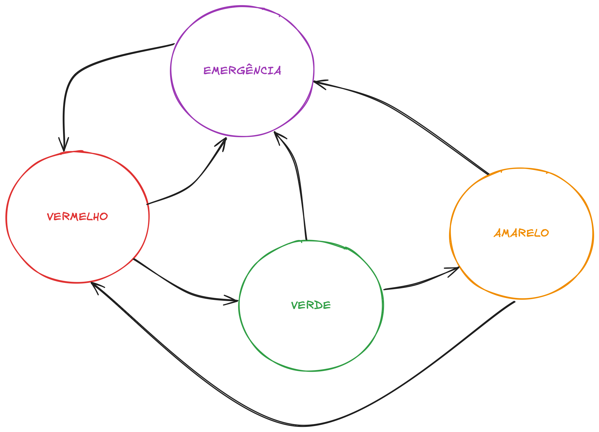

## Máquinas de Estados Finitos

### Entendendo Máquinas de Estados Finitos

Imagine um personagem de videogame que pode estar:

- Parado
- Andando
- Correndo
- Pulando

O personagem só pode estar em um desses estados por vez, e muda de estado baseado em comandos do jogador. Isso é uma máquina de estados!

#### O que é uma Máquina de Estados Finitos?

Uma Máquina de Estados Finitos (FSM - Finite State Machine) é um modelo matemático de computação que pode estar em exatamente um de um número finito de estados em qualquer momento. É uma ferramenta poderosa para modelar comportamentos de sistemas que possuem estados distintos e transições entre eles.

Uma FSM é definida formalmente pelos seguintes componentes:

- **Estados (S)**: Um conjunto finito e não-vazio de condições ou situações nas quais o sistema pode existir
- **Alfabeto de entrada (Σ)**: Um conjunto finito de eventos ou entradas que podem desencadear transições
- **Estado inicial (s₀)**: O estado em que a máquina começa sua operação
- **Função de transição (δ)**: Define como a máquina muda de um estado para outro baseado no estado atual e no evento que ocorre
- **Estados finais (F)**: Um conjunto (possivelmente vazio) de estados que indicam a conclusão da operação da máquina


### Representação Visual de uma FSM

Uma FSM pode ser representada visualmente através de um diagrama de estados, onde:

- Os círculos (Dormir,Acordar) representam estados
- As setas (--->)representam transições entre estados
- Os rótulos nas setas (Alarme, Dormir) indicam os eventos que desencadeiam as transições

```
+--------+   Alarme   +--------+
| Dormir |----------->| Acordar|
+--------+            +--------+
    ^                     |
    |      Dormir         |
    +---------------------+
```


### Por que usar Máquinas de Estados Finitos?

As FSMs são particularmente úteis em programação de sistemas embarcados pelos seguintes motivos:

1. **Organização do código**: Permite dividir o comportamento do sistema em estados distintos e gerenciáveis
2. **Clareza**: Torna o fluxo de controle mais claro e fácil de entender
3. **Manutenção**: Facilita a adição de novos comportamentos sem modificar o código existente
4. **Previsibilidade**: Garante que o sistema esteja sempre em um estado conhecido

### Aplicando em projetos de sistemas embarcados

No Arduino, uma FSM nos ajuda a organizar o código em partes mais gerenciáveis:

- Em vez de código confuso com muitos ifs aninhados

```C
// Abordagem com ifs aninhados
void loop() {
  if (botaoPressionado) {
    if (ledAceso) {
      // Fazer algo
    } else {
      // Fazer outra coisa
    }
  } else {
    // Fazer algo completamente diferente
  }
}
```
- Usamos uma abordagem clara baseada em estados

```C
// Usando maquina de estados

enum Estado {DESLIGADO, LIGADO, PISCANDO};

Estado estadoAtual = DESLIGADO;

void loop() {
  // Verifica entradas e muda estado se necessário
  verificarTransicoes();
  
  // Executar ações do estado atual
  switch (estadoAtual) {
    case DESLIGADO:
      // Ações quando desligado
      break;
    case LIGADO:
      // Ações quando ligado
      break;
    case PISCANDO:
      // Ações quando piscando
      break;
  }
}
```


### Tipos de Máquinas de Estados Finitos

Existem dois tipos principais de FSMs:

1. **Determinísticas**: Para cada estado e entrada, há exatamente uma transição para um próximo estado
2. **Não-determinísticas**: Para cada estado e entrada, pode haver múltiplas transições possíveis

Para nossos propósitos com Arduino, utilizaremos principalmente FSMs determinísticas.

### Implementação de FSMs em Arduino

Existem várias maneiras de implementar uma FSM em Arduino:

#### 1. Usando uma variável de estado e estruturas switch-case

```cpp
enum State {IDLE, RUNNING, JUMPING};
State currentState = IDLE;

void loop() {
  switch (currentState) {
    case IDLE:
      // Código para o estado IDLE
      if (conditionToRun) {
        currentState = RUNNING;
      }
      break;
    
    case RUNNING:
      // Código para o estado RUNNING
      if (conditionToJump) {
        currentState = JUMPING;
      }
      break;
      
    case JUMPING:
      // Código para o estado JUMPING
      if (conditionToIdle) {
        currentState = IDLE;
      }
      break;
  }
}
```


#### 2. Usando funções para cada estado

```cpp
enum State {IDLE, RUNNING, JUMPING};
State currentState = IDLE;

void loop() {
  // Executa a função correspondente ao estado atual
  switch (currentState) {
    case IDLE:    handleIdleState();    break;
    case RUNNING: handleRunningState(); break;
    case JUMPING: handleJumpingState(); break;
  }
}

void handleIdleState() {
  // Código para o estado IDLE
  if (conditionToRun) {
    currentState = RUNNING;
  }
}

void handleRunningState() {
  // Código para o estado RUNNING
  if (conditionToJump) {
    currentState = JUMPING;
  }
}

void handleJumpingState() {
  // Código para o estado JUMPING
  if (conditionToIdle) {
    currentState = IDLE;
  }
}
```

### Exemplo Prático: Semáforo

Um semáforo é um `exemplo clássico`!! Lembra da nossa primeira aula? Implementamos um semáforo que faz a transição entre VERMELHO, VERDE e AMARELO. 

Agora vamos implementar esse clássico usando FSM, alem disso vamos adicionar um botão para modo de emergência.

Neste novo exemplo temos as seguinte condições de operação:

- Os `estados` são `VERMELHO`, `VERDE`, `AMARELO` e `EMERGÊNCIA`
- As `transições` ocorrem após um determinado `tempo`
- O sistema sempre segue a sequência VERMELHO → VERDE → AMARELO → VERMELHO
- De qualquer um desses estados, `pressionar o botão` leva ao estado de `EMERGÊNCIA`
- Do estado de EMERGÊNCIA, `pressionar o botão novamente` retorna ao estado VERMELHO (reiniciando o ciclo normal)

Podemos visualizar o diagrama de estados da seguite forma:



A implementação do código fica da seguinte forma:

```C
// Enumeração para representar os estados do semáforo
enum TrafficLightState {
  RED,      // Estado vermelho
  GREEN,    // Estado verde
  YELLOW,   // Estado amarelo
  EMERGENCY // Estado de emergência (piscando amarelo)
};

// Configuração dos pinos dos LEDs e do botão
const int redPin = 11;      // Pino do LED vermelho
const int yellowPin = 10;   // Pino do LED amarelo
const int greenPin = 9;     // Pino do LED verde
const int buttonPin = 2;    // Pino do botão de emergência

// Configuração de tempos para cada estado
const unsigned long redDuration = 5000;     // Duração do estado vermelho
const unsigned long greenDuration = 4000;   // Duração do estado verde
const unsigned long yellowDuration = 2000;  // Duração do estado amarelo
const unsigned long blinkInterval = 500;    // Intervalo de piscar no modo emergência
const unsigned long debounceDelay = 50;     // Tempo de debounce para o botão

// Variáveis de controle
TrafficLightState currentState = RED;       // Estado atual do semáforo
unsigned long stateStartTime;               // Tempo de início do estado atual
unsigned long lastBlinkTime = 0;            // Último tempo de piscar no modo emergência
bool ledState = false;                      // Estado atual do LED no modo emergência
bool lastButtonState = LOW;                 // Último estado estável do botão
bool emergencyMode = false;                 // Indica se o modo de emergência está ativo
unsigned long lastDebounceTime = 0;         // Último tempo de debounce
bool buttonPressed = false;                 // Indica se o botão foi pressionado

// Função para inicializar os pinos e a comunicação serial
void setup() {
  pinMode(redPin, OUTPUT);
  pinMode(yellowPin, OUTPUT);
  pinMode(greenPin, OUTPUT);
  pinMode(buttonPin, INPUT_PULLUP);
  
  Serial.begin(9600);
  Serial.println("Semáforo - Máquina de Estados");
  
  stateStartTime = millis();  // Inicia o tempo do estado atual
}

// Função para controlar os LEDs de acordo com o estado atual
void setLights(bool red, bool yellow, bool green) {
  digitalWrite(redPin, red);
  digitalWrite(yellowPin, yellow);
  digitalWrite(greenPin, green);
}

// Função principal que executa a máquina de estados
void loop() {
  unsigned long currentTime = millis();
  bool buttonState = !digitalRead(buttonPin);  // Lê o estado do botão (invertido devido ao PULLUP)
  
  // Implementação do debounce
  if (buttonState != lastButtonState) {
    lastDebounceTime = currentTime;  // Reinicia o tempo de debounce
  }
  
  // Verifica se o botão está estável há mais tempo que o debounceDelay
  if ((currentTime - lastDebounceTime) > debounceDelay) {
    // Verifica se o estado do botão mudou
    if (buttonState != buttonPressed) {
      buttonPressed = buttonState;  // Atualiza o estado do botão
      
      // Se o botão foi pressionado (mudou para HIGH)
      if (buttonPressed) {
        emergencyMode = !emergencyMode;  // Alterna o modo de emergência
        if (emergencyMode) {
          currentState = EMERGENCY;
          Serial.println("Modo de emergência ATIVADO");
        } else {
          currentState = RED;
          Serial.println("Modo de emergência DESATIVADO");
        }
        stateStartTime = currentTime;  // Reinicia o tempo do estado atual
      }
    }
  }
  
  lastButtonState = buttonState;  // Atualiza o último estado do botão
  
  // Máquina de estados do semáforo
  switch (currentState) {
    case RED:
      setLights(HIGH, LOW, LOW);  // Acende o vermelho e apaga os outros
      
      // Transição para o estado verde após o tempo de duração
      if (currentTime - stateStartTime >= redDuration && !emergencyMode) {
        currentState = GREEN;
        stateStartTime = currentTime;
        Serial.println("Transição: VERMELHO -> VERDE");
      }
      break;
      
    case GREEN:
      setLights(LOW, LOW, HIGH);  // Acende o verde e apaga os outros
      
      // Transição para o estado amarelo após o tempo de duração
      if (currentTime - stateStartTime >= greenDuration && !emergencyMode) {
        currentState = YELLOW;
        stateStartTime = currentTime;
        Serial.println("Transição: VERDE -> AMARELO");
      }
      break;
      
    case YELLOW:
      setLights(LOW, HIGH, LOW);  // Acende o amarelo e apaga os outros
      
      // Transição para o estado vermelho após o tempo de duração
      if (currentTime - stateStartTime >= yellowDuration && !emergencyMode) {
        currentState = RED;
        stateStartTime = currentTime;
        Serial.println("Transição: AMARELO -> VERMELHO");
      }
      break;
      
    case EMERGENCY:
      // Pisca o LED amarelo no modo de emergência
      if (currentTime - lastBlinkTime >= blinkInterval) {
        ledState = !ledState;
        setLights(LOW, ledState, LOW);  // Alterna o estado do LED amarelo
        lastBlinkTime = currentTime;
      }
      break;
  }
}
```
## DESAFIO1 

Teste o código acima do semáforo, para isso:
- Analise o código fornecido acima.
- Identifique claramente todos os pinos utilizados.
- Monte o circuito corretamente no simulador Wokwi.
- Carregue o código e observe as mudanças dos estados.
- Teste o modo emergência ativando e desativando pelo botão.

## DESAFIO2

Agora, chegou a hora de você dar show! E colocar a máquina pra funcionar. 

Após testar e entender o código base acima:

1. Adicione mais um botão:

  - Um botão será dedicado exclusivamente à ativação do modo emergência.(já implementado)
  - Outro botão servirá para acelerar as transições entre estados no modo normal.

2. Crie um novo estado adicional:

  - Adicione o estado "PEDESTRE", onde todos os LEDs ficam apagados por um breve momento (3 seg.) ao pressionar um `terceiro botão`, simulando travessia.

3. Adicione um sensor analógico (o potenciômetro que vimos no lab2):

  - O potenciômetro deve determinar o tempo que o semáforo fica no estado VERDE, variando entre 2 a 10 segundos.

