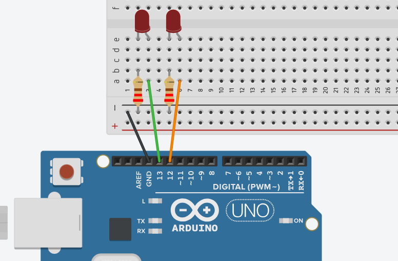

## Programação com millis()

### Problema

A função `delay()` é simples de usar, mas apresenta uma limitação, ela **bloqueia** a execução do programa, impedindo que o Arduino faça qualquer outra coisa durante a espera. Isso torna impossível realizar múltiplas tarefas simultaneamente, como:

- Monitorar botões enquanto LEDs piscam
- Ler sensores em intervalos regulares enquanto atualiza um display
- Controlar múltiplos dispositivos com diferentes tempos de atualização

### Solução

A função `millis()` oferece uma solução para esse problema:

- Retorna o número de milissegundos desde que o programa iniciou (contador sempre crescente)
- Permite criar temporizadores não-bloqueantes
- Possibilita executar várias tarefas "simultaneamente" (multitarefa cooperativa)
- Melhor utilização do processador, executando tarefas enquanto "espera"


### Implementação Prática

Para implementar um temporizador com `millis()`:

1. Armazene o valor atual de `millis()` como um ponto de referência
2. Em cada loop, compare o valor atual de `millis()` com sua referência
3. Execute uma ação quando a diferença atingir ou ultrapassar o intervalo desejado
4. Atualize sua referência para o próximo intervalo

Exemplo básico para piscar um LED a cada segundo sem bloquear o programa:

```cpp
const int ledPin = 13;
unsigned long previousMillis = 0;  // Último momento em que o LED foi atualizado
const long interval = 1000;        // Intervalo em milissegundos (1 segundo)
int ledState = LOW;                // Estado atual do LED

void setup() {
  pinMode(ledPin, OUTPUT);
}

void loop() {
  // Captura o tempo atual em milissegundos
  unsigned long currentMillis = millis();

  // Verifica se é hora de atualizar o LED
  if (currentMillis - previousMillis >= interval) {
    // Salva o último momento em que atualizamos o LED
    previousMillis = currentMillis;

    // Se o LED está desligado, ligue-o e vice-versa
    if (ledState == LOW) {
      ledState = HIGH;
    } else {
      ledState = LOW;
    }

    // Atualiza o LED com seu novo estado
    digitalWrite(ledPin, ledState);
  }
  
  // Aqui você pode realizar outras tarefas sem ser bloqueado!
  // Por exemplo, ler sensores, verificar botões, etc.
}
```

## Desafio 1: LED Piscante com millis()

**Objetivo**: Recriar o Pisca LED usando `millis()` em vez de `delay()`.



### Instruções:
1. Use o mesmo circuito do Desafio 1 do lab1.
2. Modifique seu código para utilizar `millis()` para temporização não-bloqueante.
3. Adicione as seguintes funcionalidades:
   - LED 1 deve piscar a cada 350ms
   - LED 2 deve piscar a cada 1000ms
   - Os LEDs devem funcionar independentemente (em frequências diferentes)

### Dicas:
- Crie variáveis separadas para rastrear o tempo de cada LED
- Não use `delay()` em nenhuma parte do código
- Estruture seu código de forma a permitir adicionar mais funcionalidades no futuro

## Desafio 2: Sistema Multi-tarefa

**Objetivo**: Criar um sistema que realize três tarefas simultaneamente, usando `millis()` para temporização.

### Instruções:
1. Monte um circuito com dois LEDs e um buzzer.
2. Programe o sistema para realizar as seguintes tarefas:
   - LED 1: Pisca a cada 1 segundo
   - LED 2: Sequência específica (2 segundos aceso, 1 segundo apagado)
   - Buzzer: Reproduz um bipe curto a cada 5 segundos

### Dicas:
- Use `millis()` para toda a temporização
- Organize seu código com funções separadas para cada tarefa
- Pense em como estruturar seu programa para facilitar a adição de novas tarefas no futuro
