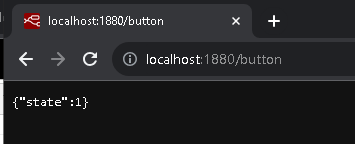
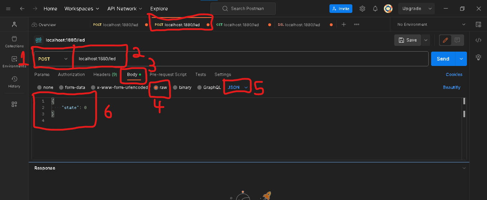

## Lab7 - API REST JSON NODE-RED


## Criando servidor no Node-Red

###  Estrutura da API:

1. Acender ou apagar o LED:
    
- Endpoint: `/led`
- Métodos:
    - GET: Retorna o estado atual do LED (0 ou 1).
    - POST: Muda o estado do LED. O corpo da solicitação deve conter um JSON com o novo estado.
    - PUT: Mesma funcionalidade do POST.
    - DELETE: Desliga o LED.
    
1. Capturar o status do botão:

- Endpoint: `/button`
- Método:
    - GET: Retorna o estado atual do botão (pressionado ou não pressionado).


O objetivo é criar os endponts `/led` e `/button` que vão representar o estado do sensor e atuador conectado ao dispositivo inteligente IoT. 

O resultado das rotas será:

- Endpoint `/led`:


- Endpoint `/button`:



- Monte o fluxo e teste:


onde:

- function10:

```JavaScript
// Supondo que o estado do LED é armazenado em uma variável global.
var ledState = global.get("ledState") || 0; // Se não estiver definido, assume 0.
msg.payload = {
    "state": ledState
};
return msg;
```

- function11:

```JavaScript
var newState = msg.payload.state;
if (newState === 0 || newState === 1) {
    global.set("ledState", newState);
    msg.payload = {
        "message": "LED atualizado com sucesso."
    };
} else {
    msg.payload = {
        "message": "Estado inválido."
    };
    msg.statusCode = 400; // Código de erro para "Bad Request"
}
return msg;

```

- function12:

```JavaScript
global.set("ledState", 0);
msg.payload = {
    "message": "LED desligado com sucesso."
};
return msg;
```

- function13:

```JavaScript
// Supondo que o estado do botão é armazenado em uma variável global.
var buttonState = global.get("buttonState") || 0; 
msg.payload = {
    "state": buttonState
};
return msg;

```

- function14:

```JavaScript
global.set("buttonState", 1);
return msg;
```

- function15:

```JavaScript
global.set("buttonState", 0);
return msg;
```

## CORS - Cross-Origin Resource Sharing

Quando você cria uma API REST, especialmente para aplicações de IoT, é comum que diferentes clientes (como navegadores web, aplicativos móveis ou outros dispositivos) tentem acessá-la de diferentes origens. Portanto, lidar com o Controle de Acesso de Origem Cruzada (CORS - Cross-Origin Resource Sharing) é uma consideração importante.

Por padrão, por motivos de segurança, os navegadores restringem solicitações HTTP de serem feitas entre sites. Isso significa que, se você tiver uma interface web rodando em um domínio ou porta e tentar fazer uma solicitação AJAX para sua API Node-RED em um domínio ou porta diferente, o navegador bloqueará a solicitação, a menos que a API indique que essas solicitações cruzadas são aceitáveis.

O cabeçalho `"Content-Type":"application/json"` informa aos clientes que a API retornará dados no formato JSON.
O cabeçalho `"Access-Control-Allow-Origin":"*"` permite que qualquer site faça solicitações à sua API. Isso é adequado para desenvolvimento ou em ambientes controlados, mas tenha cuidado ao usar essa configuração em produção devido a considerações de segurança.

## Dicas para realizar requisições 

Utilizar o `curl` é uma forma simples de testar APIs diretamente do terminal ou linha de comando.

No **`Windows`** o `CMD` interpreta alguns caracteres de maneira especial, a gente precisa ajustar a sintaxe ou usar o `PowerShell` em vez do CMD.

 
Se for no CMD, o ajuste é `\"` para usar `"` interna da chave do JSON e fica:

```bash
curl -X POST -H "Content-Type: application/json" -d "{\"state\": 0}" http://localhost:1880/led

```
 

Se for no PowerShell, não muda: permanece:

```bash
curl -X POST -H 'Content-Type: application/json' -d '{"state": 0}' http://localhost:1880/led
 ```

Os outros comandos permanecem iguais:

 
```bash
curl -X GET http://localhost:1880/led

curl -X DELETE http://localhost:1880/led

curl -X GET http://localhost:1880/button
```

Se utilizar o Postman não terá esse problema. 




## Mais informações

Faça o download do pdf da aula.
> - arquivo pdf: [lab7](slides.pdf)