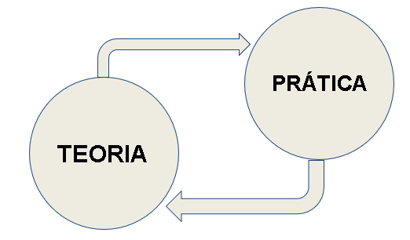

# Bem vindo disciplina de Disruptive Architectures: IA e IoT

Olá pessoal, bem vindos!! Nesta página você irá encontrar os conteúdos ministrados em sala de aula assim como dicas,atividades, laborórios e muito mais. 

- Curso: Tecnologia de Desenvolvimento de Sistemas
- Disciplina: Disruptive Architectures: IA e IoT
- Repositório com todos os arquivos está disponivel em: [https://github.com/arnaldojr/DisruptiveArchitectures/](https://github.com/arnaldojr/DisruptiveArchitectures/)

Prof. Arnaldo Viana

## Objetivos

Nosso curso está dividido em IA e IoT, ao final da disciplina o estudante será capaz de:

- Compreender os conceitos de Análise de dados, Machine Learning (ML) e Deep Learning (DL)
- Aplicar conceitos e técnicas de DL
- Desenvolver pequenos projetos envolvendo IA.
- Compreender o conceitos de sistemas baseados em IoT (Internet das Coisas)
- Conhecer as principais tecnologias habilitadoras da IoT
- Programar e desenvolver pequenos projetos de IoT

## O que preciso ter/saber para acompanhar esse curso?

- Lógica de programação
- Python básico
- Algebra linear
- Dedicação

## Dinâmica das aulas:

O curso é baseadas em desafios (exercicios, atividades, pesquisa e etc.) que abordam teoria e prática.

Por essa razão as aulas estão divididas em pequenos laboratórios, cada laboratório possui os seus objetivos especificos. 

## Quais software preciso instalar para acompanhar esse curso?

Basicamente, vamos trabalhar com scripts em python e algumas bibliotecas que podem ser executados localmente ou em nuvem. 

Como sugestão de instalação local:

* [Python 3.x](https://www.python.org).
* [Jupyter Notebook](https://www.jupyter.org).
* [Anaconda](https://www.anaconda.com).

Em nuvem:

* [Google Colab](https://colab.research.google.com).
* [Kaggle](https://kaggle.com).

## Idéias de projetos

As aplicações são vastas e diversas... Para ajudar a despertar a curiosidade, pense de que forma podemos utilizar ML para resolver um problema do nosso dia a dia.